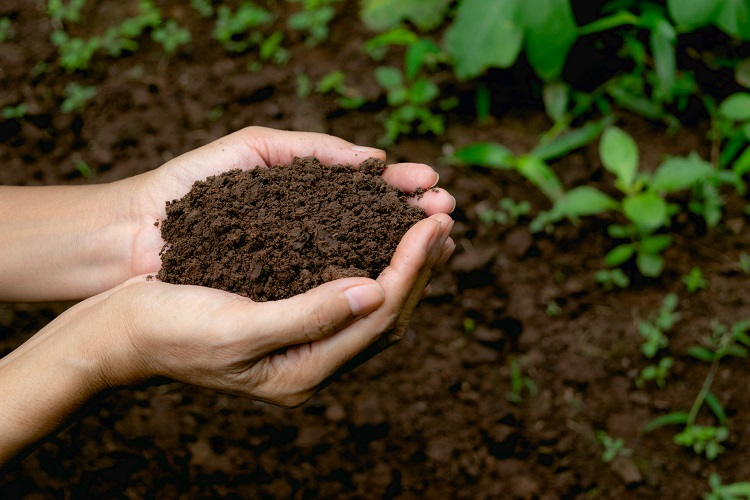
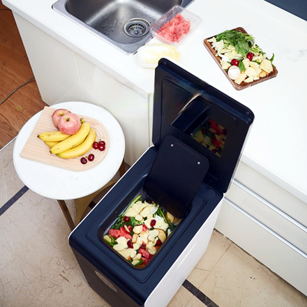
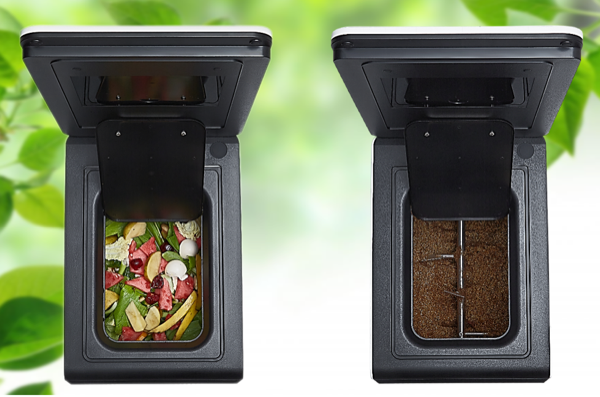

# 6 Easy Garden Tips to Save Money and Grow More Plants

People are seeking ticks to grow plants easily and spend less cost in fertilizers. Here are 6 tips for you.

<!-- truncate -->

## Tip1: Soil

Soil is the basis for the growth of flowers and trees, which is not only a support for the growth and development of fixed plant roots, 
but also provides the necessary nutrients, water, and air for plant growth.

Whether you are planting in the garden or in pots, you will need to improve the soil before planting.

## Tip2: Start your plants from seed 

In your daily life, you eat fruits and don't waste the seeds, you can collect them, instead of buying them.
A few factors that determine whether your seeds will germinate?（plus links）

1. sunlight
2. oxygen
3. water
4. temperature
5. fertile soil suitable for planting germination 

soil suitable for seed germination should be fertile, harmless, loose, breathable, water and fertilizer retention. 
You can add the organic waste generated by GMEM decomposition directly to your garden soil and potting soil without 
and the easiest and most efficient way to get the cheapest organic fertile soil.
It is worth noting that scorched garbage produced by high temperature and grinding has a seed germination index of 0, 
which will not allow your seeds to germinate and temperatures toxins that will make your soil toxic.
（The dangers of scorched garbage. plus links）

## Tip3: Protect from heat and cold
Look around your house, there must be something available. With discovery and eyes, 
you will find something that can shield your lovely plants.

For example:

Use the big-size water container to cover your little plant.

## Tip4: Fertilization
Fertilizer is the source of nutrients needed for flower growth and directly affects the growth and development of flowers. 
For different plants, at different growth stages, the right amount of nutrients should be applied at the right time 
in order to make flowers flourish and bloom.

How to make home-made organic fertilizer?（plus links）

1. Composting of yard waste by using the shaded corners of the yard.（plus links）
2. Fast composting of food waste with GEME（plus links）

## Tip5: Save your fall leaves in the garden
Putting fall leaves on your growing plant can help to warm up during the winter.

## Tip6: Turn your food waste into fertilizer

Harvest! Enjoy the fruits, vegetables, and flowers you've grown with your hands!
But...Every human eats, and food waste is the common garbage in almost every family.
Stop buying expensive dirt and soil, use the GEME composter to free your time and kitchen space.
Food waste in, fertilizer out.

Try it out
https://www.geme.bio/product/geme
