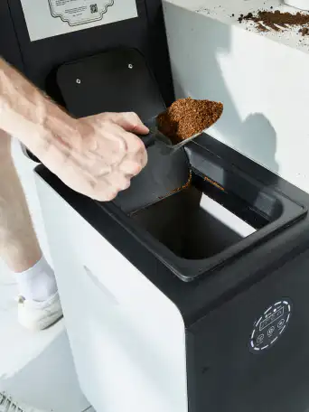

# 4 Reasons You Have to Love Composting

Composting, consider the new fashion for sustainable living. Most of people might not know about it.
But it is happening all the time. I promise, once you know about it, you will see it everywhere.

<!-- truncate -->

## Composting contributes to the nutrient cycling and soil quality of the soil

Garden soil is a soil type that has been used with high intensity over a long period of time and has a fertile, humus-rich layer at a depth of more than 40 cm.

Typically, garden soils contain more than 4% by weight of organic matter. This humus-rich soil layer is cultivated by long-term horticultural use and regular input of large amounts of organic matter (e.g. compost).

Frequent irrigation and longer periods of shade have contributed to the formation of garden soils.

Due to the high organic matter content, garden soils contain large amounts of important nutrients, including not only major nutrients such as nitrogen, phosphorus and potassium, but also magnesium, calcium and micronutrients such as selenium and manganese.

The importance of soil organisms such as fungi, bacteria, algae, worms and insects cannot be underestimated either.

Soil organisms provide essential nutrients to the soil, break down organic matter to form humus, and ensure adequate soil aeration; soil organisms are abundant in garden soil.

As long as gardeners follow good practices, they can make an important contribution to maintaining good soil conditions and thus to protecting the environment. Doing so can also promote nutrient cycling and improve soil quality.

## Composting maintains the stability of the soil

An important element of the above good practice specification is to maintain a specific pH of the soil through appropriate methods. pH can indicate whether the soil is alkaline, neutral or acidic. Lime content is pH dependent. Crops require a specific soil pH for optimal growth. pH also determines to a large extent the type of organisms in the soil. Fluctuations in pH caused by lime leaching and environmental changes (acid rain) have a significant impact on the ecological balance of the soil.

If the soil is too acidic, nutrients will dissolve faster and plants will be able to take up nutrients more fully. However, since plants cannot absorb too many nutrients, some nutrients are lost and may leach into groundwater, which can have a negative impact on the environment and lead to eutrophication, among other things.

The use of compost products will strengthen the soil's buffering capacity against pH fluctuations. In addition, the alkalinity in the compost will ensure that the soil does not acidify.

## Composting can improve and maintain soil fertility

The purpose of composting is to produce humus, which in the nutrient cycling process to hold nutrients for the soil and improve or maintain soil fertility. The composting process begins with the biological decomposition of organic matter. The activity of soil organisms and the rate of organic matter decomposition rate depends on.

▸ The temperature of the soil interior and surface layers

▸ Moisture content of the organic material

▸ Oxygen content

▸ pH value

If organic matter enters the soil through compost or plant residues, substances that are easily mineralized, such as proteins and monosaccharides, are broken down first. In this process, minerals that are present in plant cells in the form of salts or that are easily decomposed are released. The intermediate products of the decomposition process with tannins, waxes or persistent substances such as cellulose and lignin are broken down more slowly.

The organic matter fragments and the newly formed intermediates combine to form a stable humus layer. These humic substances are very resistant to decomposition and guarantee the long-term fertility of the soil.

In addition, some minerals (especially nitrogen and sulfur) become permanently bound in the intermediate products.

During this complex transformation of organic matter, complexes of clay humus are gradually formed and they provide favorable physical conditions for the soil (air circulation and soil structure).

If new materials are not added frequently, the decomposition and transformation process slows down, but does not stop completely.

Even when finished compost is spread on the soil it decomposes slowly and gradually releases its nutrients, minerals and humus as well as nutrients together also enter the soil and the mineral mixture becomes part of the soil mineral body (e.g. sand or silt).

Humus is consumed every year and needs to be replaced.

For natural soil, this process is done through the natural cycle of fallen leaves and herbs on the ground.

For cultivated soil, people must take the initiative to recover organic matter and complete the replacement and supplement of humus through composting, mulching, surface composting, green fertilizer and choosing the right crop rotation.

The loss of humus is not immediately manifested as the loss of nutrients, but gradually reflected in the deterioration of soil structure.

To achieve optimal growth, plants need a high proportion of humus to store water brought by rainfall to ensure an adequate water supply for plants and soil organisms.

Soil with high humus content is equivalent to fertile soil.

The loss of humus is equivalent to the loss of species.

The high content of humus in soil ensures the health of plants to a certain extent.

In humus-rich soil, a variety of soil organisms will release energy and raise soil temperature, which is beneficial to both plants and soil organisms.

The newly added nutrients will be preserved in the root area of the plant and will not be easily lost.

The lack of humus will lead to the deterioration of soil physical structure and lead to a series of disastrous consequences.

The soil structure was destroyed and the formation process of aggregate structure stopped, which hindered air circulation and water supply.

Environmental threats such as soil erosion and wind erosion will also further lead to the loss of humus.

## GEME makes compost more efficient and more nutritious

GEME is your little helper for easy home composting!

No more smelly, leaking garbage, puffing fruit flies, a yard full of mice, maggots in the yard waste bin, or throwing away food scraps to rot in the landfill.

With GEME, you will be able to turn your waste into nutrient-rich organic compost. Revolutionize the way you dispose of your waste while returning nutrient-rich soil to the earth.

With GEME, you can easily harvest organic compost within 6-8Hr, no need to turn over the pile, no need to pay attention to the carbon-to-nitrogen ratio of the garbage input, no additional management, no need to pay attention to the weather, and worry-free composting in all seasons. Composting has never been easier.

Come on, start composting!

