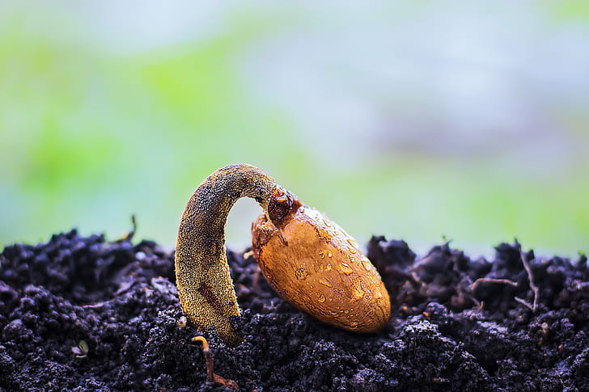

# The secret of seed germination

Thoreau said: If you have a seed, I'm ready to see a miracle.

In early January 2019, a seed of cotton performed a miracle by logging on to a lunar rover on the back of the moon, 
where it stubbornly sprouted, becoming the first plant to successfully sprout on an alien planet.
<!-- truncate -->

If you feel that seeds can germinate on the outer planets but find that the seeds you planted are slow to germinate, 
you must read the following article. It will tell you how seeds sense their environment and germinate. 
It will also unlock the secret of why your seeds are not germinating.

[The secret of seed germination: Soil](/blog/the-secret-of-seed-germination-soil)

[The secret of seed germination: Seed](/blog/the-secret-of-seed-germination-seed)

[The secret of seed germination: External conditions](/blog/the-secret-of-seed-germination-external-conditions)
