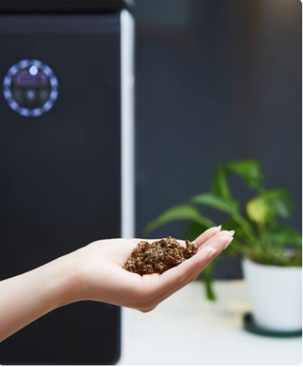

# The secret of seed germination part 1: Soil

Soil is the basis for the growth of flowers and trees. 
It not only supports the growth and development of fixed plant roots but also provides the necessary nutrients, water,
and air for plant growth.
<!-- truncate -->

## (1) Soil requirements.

Fertile, harmless, loose, breathable, water and fertilizer retaining.

## (2) Potting soil material

In addition to the commonly used soil, some mineral materials and biological materials are also used, 
the meaning of potting soil is not only limited to soil, so the materials on which plants live are often referred to as 
substrate or media.

Commonly used substrates are: garden soil, mud, pond mud, sand, earthworm dung, cinder, vermiculite, perlite, 
ceramic particles, brick particles, huller, huller ash, wood chips, charcoal, grass clippings, bark, cotton seed shells,
peanut shells, pine needles, moss, coconut coir, bagasse, etc.

## (3) Soil acidity

The acidity of soil affects the growth and development of flowers. Most flowers are suitable for slightly acidic soil with pH 6.0-7.0 (soil pH 7 is neutral soil).

Camellia, azaleathat , orchids, bromeliads and other flowers require a more acidic soil environment. Usually requires a pH of about 5-6. Therefore, these flowers should be cultivated with more humus mountain clay (orchid clay) in order to grow well.

Dianthus, dahlias, cacti, human spices, pomegranates, grapes, kiwis have a wide range of adaptation to soil acidity, and can grow in a pH 6-8 environment.

For alkaline heavy soil, you can add sulfur powder or ferrous sulfate, aluminum sulfate to adjust, usually the application amount of sulfur powder is 0.1-0.2% of the total soil.

For acidic heavy soil can be adjusted with lime powder, the application amount of 35 to 70 grams per square meter of land.

## (4) Soil improvement

The soil for planting flowers in the courtyard must be cleared of all kinds of construction debris within 40cm of the soil surface.

Planting tree cavity location, cave depth of 60-80cm should be replaced with new soil.

For clay soil, coarse sand and organic matter with more fiber should be added to facilitate drainage and increase the permeability of the soil and the content of organic matter.

The preparation of soil for potted plants should be based on the requirements of planting plants and pay attention to the permeability, fertility, and suitable soil acidity of the soil. Usually use fertile garden soil (hot soil) plus hulled ash at a ratio of 2 to 3: 1 made of a cultivation substrate.

However, urban floriculture is limited to the conditions, it is not easy to obtain high-quality cultural soil.

How to get good quality soil for cultivation?

The feasible methods are as follows:

1. You can collect fallen leaves, sawdust, peanut shells, bean shells, eggshells, bagasse, poultry feathers, fish bones, 
shrimp shells and other household waste . After cutting fine and broken, add water, place in old jars or plastic bags, 
and then after a longer period of fermentation and maturation, dried, sieved, with part of the raw mud 
(roads, infrastructure excavations out of the earth), mixed and prepared into a potted nutrient soil.

2. The soil replaced by potting can also be mixed with household waste and composted for reuse after 4-6 months. 
Strictly potting soil needs to be disinfected . Home flower gardening can be a simple daylight disinfection method . 

3. That is, in the summer it will be spread on the cement board, covered with plastic film, in strong sunlight exposure 
3 to 4 big, can kill a large number of soil disease spores, mycelium and pest eggs, and nematodes. In addition, 
heat disinfection and chemical disinfection are also available.

Use GEME, put your food waste, puppy poop, etc. into GEME, and you will be able to harvest the best soil humic acid conditioner after 6-8 hours.
It saves time, money, and effort and is safe.

Food waste is rich in protein and after it is broken down by the high-temperature complex microbial GEME-Kobold, 
you will have an all-natural organic compost. This organic compost rich in GEME-Kobold contains many nutrients needed 
by plants and activates beneficial microorganisms in the soil, which not only promotes place seeds to germinate but also
makes flowers smell better and fruits sweeter.

Click to see GK Resource Recycling Technology(plus links) to learn more.

The soil is ready, now you can put your seeds into your carefully prepared soil.

But what kind of seeds can germinate?
Please follow us!
[Season 2 Seed](/blog/the-secret-of-seed-germination-seed)
