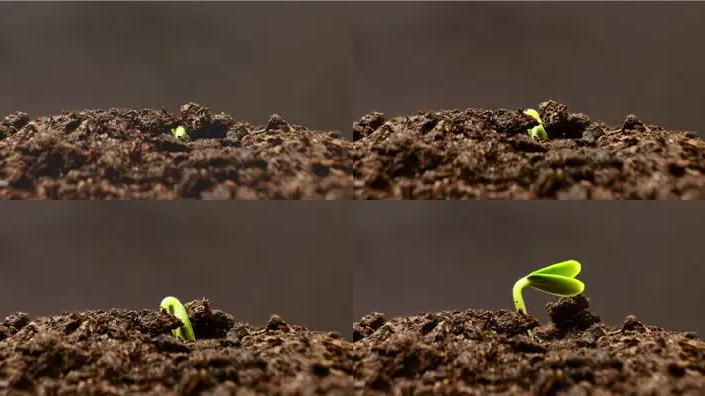
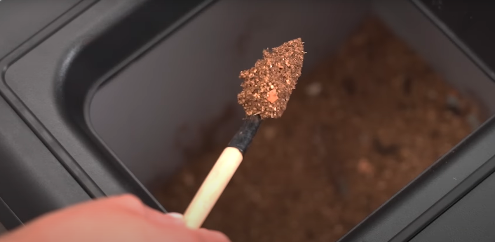

# The Secret of Seed Germination Part 2, Seed

What kind of seeds can germinate?

The intrinsic conditions for seed germination refer to two main aspects.

First, the seed itself has the ability to germinate (germination potential), i.e., the seed is alive and not dead.

Second, the seeds are capable of germinating when given the conditions necessary for germination.

Therefore, whether it is a direct seeding or a seedling, it must be a viable seed.
<!-- truncate -->

However, the seeds of many vegetable crops (such as onions, leeks, etc.) have a short seed life and almost lose their 
germination ability when stored indoors for more than a year, so for vegetable crops with a short seed life, new seeds 
should be sown and old seeds should not be used as much as possible.

Even for vegetable crops with long seed life, such as tomatoes and cabbage, it is better to check their germination rate 
before sowing.

On the other hand, some vegetable seeds, even with vigor and given suitable germination conditions, sometimes still do 
not germinate. This situation is called dormancy. In order for the seeds to germinate and emerge smoothly after sowing,
measures should be taken to release the dormancy of these seeds with dormant characteristics before sowing.

The organic compost produced by degrading the bio-waste through GEME is enriched with more than 46 identified soil 
bacteria and keeps the soil in good condition faster than individual soil bacteria. Sowing seeds in it can greatly 
enhance the germination rate of seeds and make plants' roots stronger.

Great, now that you have the right soil and good seeds ready, you can start sowing.

So will the seeds germinate smoothly next?

[Season 3 External conditions required for seed germination](/blog/the-secret-of-seed-germination-external-conditions)
