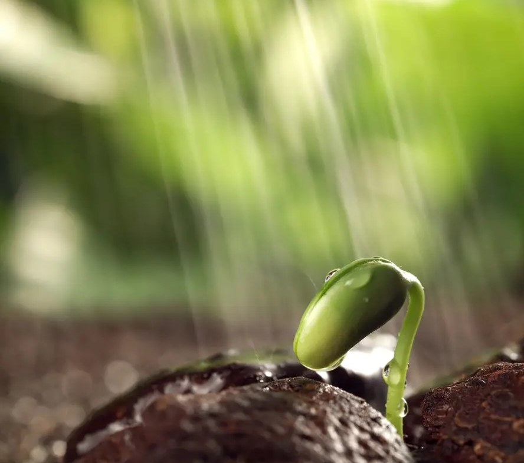

# The Secret of Seed Germination Part 3, External Conditions

Seeds have high requirements for environmental conditions in the germination process. Under suitable conditions, 
seeds can germinate rapidly and grow strong seedlings in a relatively short period of time. If they cannot be met, 
the quality of seed germination will be affected to varying degrees.

<!-- truncate -->

Adequate moisture, suitable temperature and sufficient oxygen are the three basic conditions essential for seed 
germination (i.e., the three elements of germination).

In addition to light, carbon dioxide and other factors also have an impact on seed germination.

[The secret of seed germination Part 3: Ⅰ. Moisture](/blog/the-secret-of-seed-germination-external-conditions-moisture)

[The secret of seed germination Part 3: Ⅱ. Temperature](/blog/the-secret-of-seed-germination-external-conditions-temperature)

[The secret of seed germination Part 3: Ⅲ Oxygen](/blog/the-secret-of-seed-germination-external-conditions-oxygen)

[The secret of seed germination Part 3: Ⅳ Light](/blog/the-secret-of-seed-germination-external-conditions-light)
