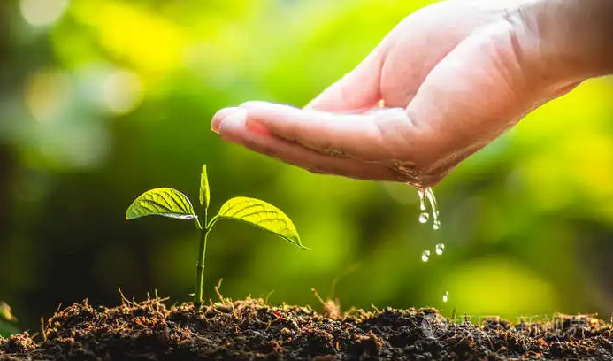
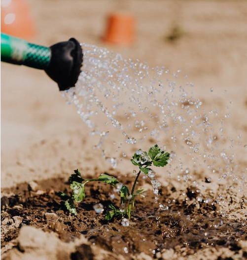

# The Secret of Seed Germination Part 3, External Conditions: Moisture

Moisture is the most basic condition required for seed germination.

Only after the seeds have absorbed a large amount of water can the stored nutrients be converted into substances 
necessary for life activities.

<!-- truncate -->

Moisture also softens the seed coat, increases permeability, and accelerates the germination of the seeds by water absorption.

Before germination, the seeds must absorb a certain amount of water. But the amount of water absorption and water 
absorption rate varies according to the type of vegetables, which depends mainly on the structure of the seed coat and 
the nutrient content of the seed storage.

Seeds containing more protein absorb water faster and more.

Seeds containing more starch absorb water slowly and less.

Seeds containing more fat are in between.

Seeds with good permeability of the seed coat absorb water quickly.

Seeds with dense seed coats and poor permeability absorb water slowly.

Crucifera, legumes, tomatoes, cucumbers and other vegetable seeds have a good permeability of the seed coat.

Umbelliferae, eggplant, pepper, watermelon, winter melon, bitter gourd, onion, spinach and other vegetable seeds with a
more difficult permeability of the seed coat.

Therefore, when soaking seeds to be reasonable according to these characteristics of the time; if the swelling time is
too long, it will lead to seed nutrient extravasation and seed viability decline.

In addition, vegetable seeds after sowing, its germination rate and soil moisture content are closely related, should 
be based on the type of vegetables to master the soil moisture content.

The organic compost generated by the decomposition of bio-waste through GEME enables the fast-acting carbon and steady-state talk in the soil to act synergistically with mineral nutrients, thus enhancing the physicochemical properties of the soil and promoting the formation of the soil's agglomerate structure, making the soil looser, more permeable and breathable, and more conducive to seed germination.

After the seed has absorbed sufficient water, what external conditions need to be provided next to allow it to germinate successfully?

Follow me and keep exploring!

[II. Temperature](/blog/the-secret-of-seed-germination-external-conditions-temperature)
