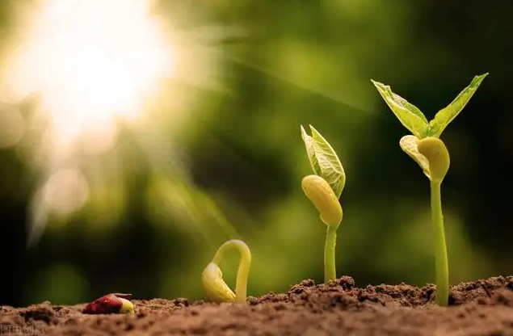

# The Secret of Seed Germination Part 3, External Conditions: Temperature

Temperature is important.

Seeds require the right temperature for germination.

Different vegetable species of seed germination minimum, maximum and optimum temperature is different.

Temperature-loving vegetables (melon, eggplant, and some beans) require a higher temperature, the appropriate temperature 
of 20 to 30 ℃, the maximum temperature of 35 to 40 ℃, and the minimum temperature of 10 ℃.

Hardy, semi-hardy vegetables (cabbage, kale, mustard, etc.) germination temperature of 15 ~ 25 ℃, the maximum temperature 
of about 30 ~ 35 ℃, and the minimum temperature of 0 ~ 4 ℃.

But the seeds of most vegetables can germinate better in the range of 15 to 30 ℃.

Among them, some vegetable seeds are suitable for germination in a wide range of temperatures, such as cabbage vegetables.

Some are narrower, such as lettuce.

In general, within the appropriate temperature conditions, the seed germination rate is higher, and the germination time 
is shorter.

If higher than the appropriate temperature, although the seeds germinate faster, the quality of the buds is poor (there 
are also some vegetable seeds that can not germinate when higher than the appropriate temperature, especially lettuce, 
and celery seeds).

If lower than the appropriate temperature, the seed germination time is extended and the germination rate is also lower 
(in high humidity even causes rotten seeds), seedling growth is relatively weak.

Some kinds of seeds germinate less well under constant temperature conditions than under variable temperature conditions, 
such as eggplant is more typical of the need for the variable temperature to germinate good vegetable crops, the day and night temperature difference of 8 to 10 ℃ when the best germination, that is, day temperature 30 ℃ / night temperature 20 ℃ of variable temperature.

In fact, after sowing, vegetable seeds are always in certain diurnal temperature difference conditions.

With the addition of by-products from GEME-treated bio-waste to the soil, the organic matter in the soil is greatly enhanced,
soil consolidation is broken up, and the trace elements in the soil are significantly increased, which is more conducive 
to soil insulation and moisture retention and will better promote seed germination.

Well-hydrated seeds will germinate immediately at the right temperature. But... There seems to be something missing.

[II. Oxygen](/blog/the-secret-of-seed-germination-external-conditions-oxygen)
