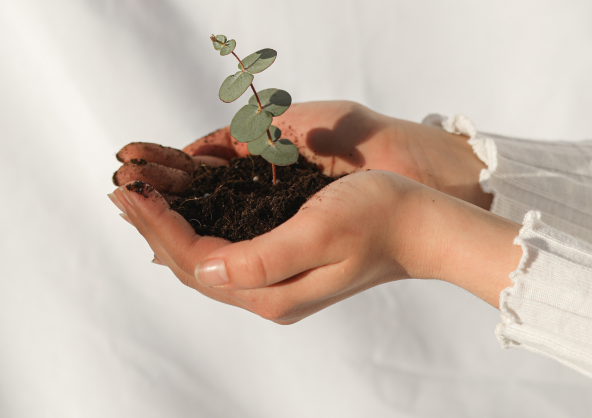

# The Secret of Seed Germination Part 3, External Conditions: Light

The effect of light on the germination of vegetable seeds varies from species to species, but most vegetable seeds do 
not respond to light when germinating.
<!-- truncate -->
According to the sensitivity of seed germination to light, vegetable seeds can be divided into three categories.

The first category is light-demanding seeds, that is, seed germination requires a certain amount of light, and in dark 
conditions can not germinate or germinate poorly. Such as cabbage, kale, lettuce, celery, carrots, etc.

The second category is the aversion to light seeds, that is, the seeds require dark conditions to germinate, and there 
is light in poor germination. Such as melons, amaranth, onions, leeks, etc.

The third category is the middle-light seeds, that is, in light or dark conditions it can be normal germination. Most 
vegetable seeds, such as beans, fall into this category.

Understanding the impact of light on seed germination can be taken in the sowing or germination process to take appropriate 
measures to improve the germination rate and seedling rate.

Now you know that not all plants need the same amount of light at all stages of growth. Many plants are in the seed stage, 
or even the growing stage and they may not need more sunlight. So it's perfectly fine to grow them in your home or on a 
shaded balcony.

If you own a [GEME](https://www.geme.bio/product/geme), then it will help you eat all the leftovers and expired food, even puppy poop anytime, and also give 
you the best organic compost for conditioning your soil so that having a small garden or vegetable garden at home or on 
your balcony just for yourself is no longer something you desire but cannot reach.

Come on, let's reduce our carbon footprint and start living green from now on.
