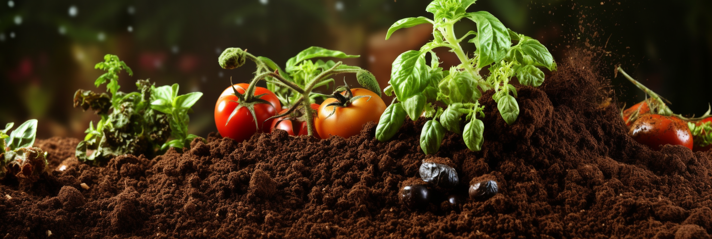
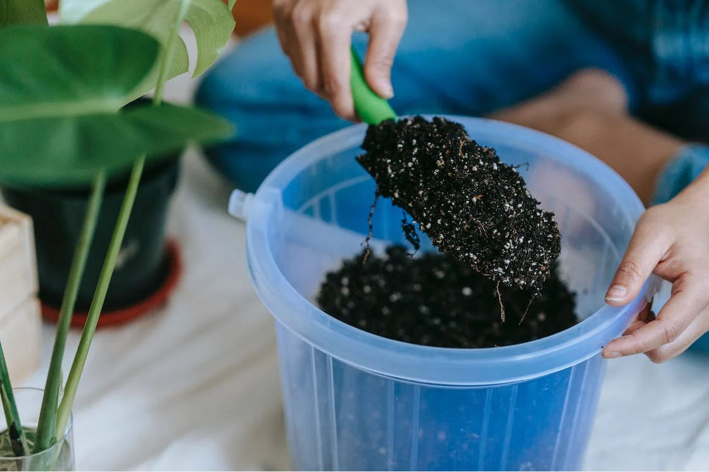

# How to make home-made organic fertilizer?

Fertilizer is the source of nutrients needed for plant growth and directly affects the growth and development of plants. 
For different plants, the required nutrients should be applied at the right time and in the right amount at different 
growth stages in order to make the plants grow with lush leaves and flowers.
<!-- truncate -->

The 16 nutrients needed for plant growth

Carbon, hydrogen, oxygen (obtained in air and water), nitrogen, phosphorus, potassium, sulfur, calcium, magnesium, iron, boron, zinc, copper, manganese, molybdenum, chlorine

So, which fertilizer should we apply for different plants? How to apply fertilizer? And how to make fertilizer at home in an easy and economical way?

- [How many types of fertilizers](/blog/how-many-types-of-fertilizers)
- [Preparation of organic fertilizer for home plant growing](/blog/preparation-of-organic-fertilizer-for-home-plant-growing)
