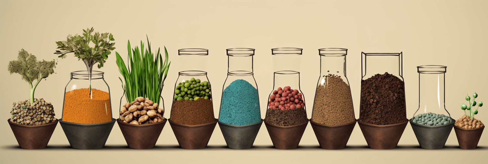
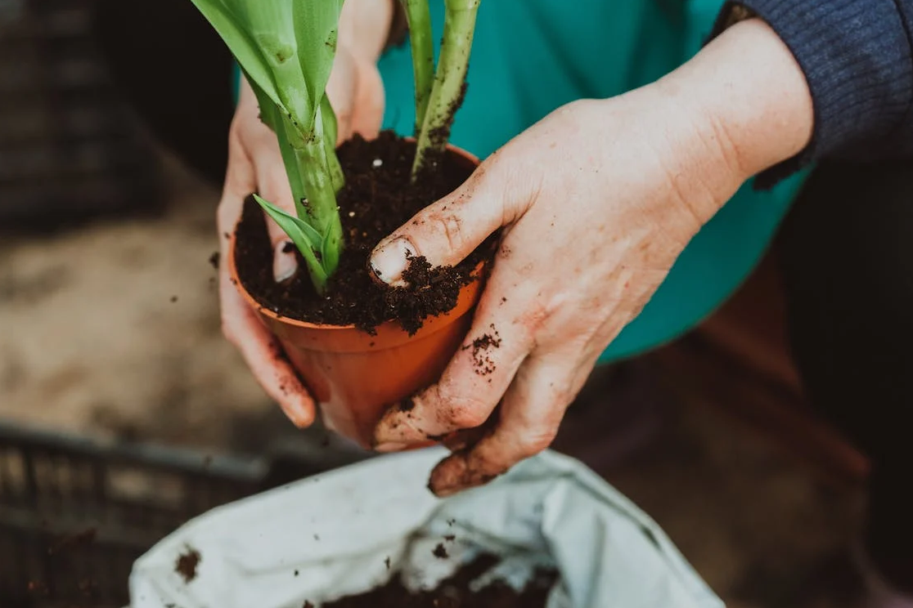
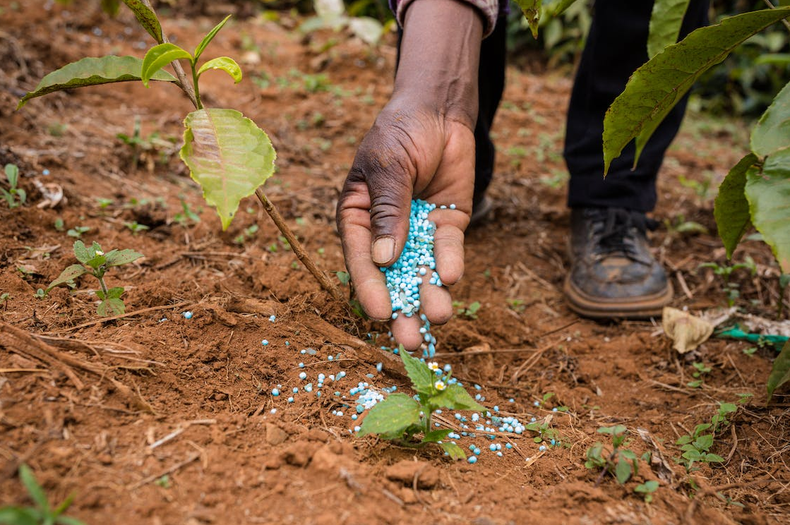

# How many types of fertilizers

In today's world where everyone is a gourmet, people are constantly researching new cooking rules and new gourmets, 
while focusing more on the safety of the ingredients themselves.
<!-- truncate -->
However, modern agriculture with chemical fertilizers and pesticides has not only lowered the safety factor of 
agricultural products, but also reduced the taste of ingredients: the leaves are less full of freshness, melons and 
fruits have lost a touch of natural sweetness, and even tomatoes do not have the original taste.

"Tasty and safe crops" has become the goal of the consumer's table.

## Organic fertilizer: a buffet that plants love

Why are today's crops "tasteless"? For a long time in the past, the pursuit of quantity was a major goal of agriculture,
and in order to complete the incremental increase in quantity, chemical fertilizers were once used excessively, which 
led to a reduction in organic matter in the soil, without organic matter to support the soil lost the ability to provide 
the original taste of crops.

Now, with the big step of consumer upgrading, people's pursuit of agricultural products from quantity back to quality, 
summoning organic fertilizer has become the wind direction of agriculture this year.

Just as humans need to eat, plants need to absorb nutrients to meet their growth needs.

Chemical fertilizer and compost are like the two eating positions of a plant. They both seem to be able to absorb
nutrients and grow up, but there are essential differences.

Compared to chemical fertilizer, organic fertilizer is more like a buffet that plants like to eat, controlling the rhythm of feeding themselves and asking for what they need.

The humus produced by organic fertilizer contains rich nutrients needed for plant growth, and because it is insoluble in water and decomposes slowly, it can release nutrients steadily to meet the nutritional replenishment needed by crops throughout their growth cycle.

At the same time, organic fertilizers stimulate plants to develop a well-developed root system and cooperate with microorganisms in the soil to decompose and absorb the nutrients stored in humus.

Plants grown in this environment are stronger, contain more phytonutrients, and have better flavor.

In addition, organic fertilizer is beneficial to improve the sub-health state of soil.

Organic fertilizer can increase the organic matter in soil, promote the formation of soil aggregate structure, increase the looseness of soil, and the ability to preserve water, heat preservation, fertilizer and air permeability.

Rich soil organic matter is also an important source of energy and nutrients for soil organisms and microorganisms, which constitutes the foundation of biodiversity.

See more at GK Resource Recycling Technology.

## Chemical fertilizer: overeating of plants

Inorganic fertilizer (chemical fertilizer) one by one with chemical methods of manufacture or natural mineral processing
made of fertilizer.

Chemical fertilizers have the characteristics of simple composition, high nutrient content and fast and furious 
fertilization.

The active ingredients of chemical fertilizers are easily soluble in water and absorbed by plants, which makes it easy 
for plants to deviate to the path of "overeating".

At the same time, the use of chemical fertilizers can cause the soil to lose its balance: heavy metals and toxic elements 
increase, microbial activity decreases, and nutrients become out of balance ......

Commonly used inorganic fertilizers include: urea, ammonium sulfate, nitrate, potassium phosphate, potassium chloride, 
potassium nitrate, etc. As well as after processing and compounding, containing nitrogen, phosphorus, potassium with 
three elements of compound fertilizer.

To satisfy our taste buds and live a more natural and green life, we prefer to provide our plants with a delicious 
buffet - organic fertilizer. But, how to get organic fertilizer?
