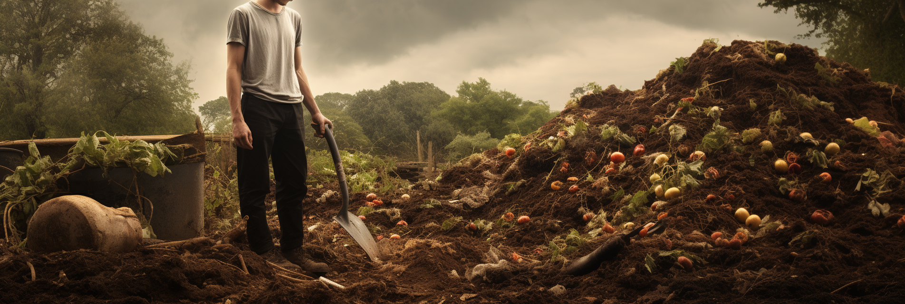

# Organic Compost - Complete Composting Guide

Falling red is not heartless, turned into spring mud to protect flowers-creatures on earth-- including us, are returning 
the energy and nutrients they get from nature to nature in this way.
<!-- truncate -->
Composting is to simulate this natural law, people collect the organic matter around, and provide appropriate temperature,
humidity, and other conditions . Let this organic matter through microbial decomposition into humus, the nutrients will 
be recovered and provided for plant growth and reproduction.

You will learn about composting from the following guide.

- [3 principles for successful composting](/blog/3-principles-for-successful-composting)
- [10 Things New Composters Must Know - How to Get Quality Compost](/blog/10-things-new-composters-must-know-how-to-get-quality-compost)
- [4 Reasons You Have to Love Composting](/blog/4-reasons-you-have-to-love-composting)
- [Complete composting material list](/blog/complete-composting-material-list#shredded-tree-and-hedge-branches-and-leaves)
- [You have garbage? I have the method! A complete list of different bio-waste composting methods](/blog/a-complete-list-of-different-biowaste-composting-methods)
- [Composting Tips All Explained](/blog/composting-tips-all-explained)
- [Hygiene and safety of composting](/blog/hygiene-and-safety-of-composting)
- [A few important tips about composting](/blog/a-few-important-tips-about-composting)
- [When will the compost be ready to be made?](/blog/when-will-the-compost-be-ready-to-be-made)
- [How to test the success of composting](/blog/how-to-test-the-success-of-composting)
- [6 steps to make successful composting easy](/blog/6-steps-to-make-successful-composting-easy)
- [How to use compost](/blog/how-to-use-compost)
