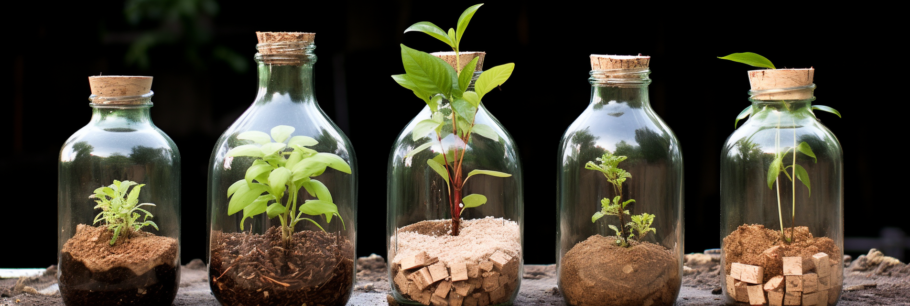

# Use bottles to make fertilizer at home

You can use cola bottles, oil blending bottles, and other small-mouth waste plastic bottles as containers, 
injecting fish scales, fish guts, eels, shrimp shells, and other animal offal, fermentation, maturation made of 
high-quality liquid quick-acting fertilizer. You can also use bad soybean-soaking compost. Bottle system organic 
fertilizer in the preparation should pay attention to.
<!-- truncate -->
① fish feet injection amount for the bottle capacity of about 1/2 a 2 / 3. And add water close to the mouth of the 
bottle (need to leave a certain gap).

② To reduce the odor of fertilizer fermentation can be put into a part of the orange degree at the same time, generally 
a 2.5-liter bottle of the blended oil can put 3 or 4 orange peels. Orange peel can be torn pieces or cut fine and put 
down. You can use fresh orange peel, air-dried aged orange peel is also available.

③ The bottle cover tightly must be backed up again after 2 or 3 teeth, in order to leave the air gap, otherwise easy to 
bottle fermentation, gas expansion out of the bottle cover, resulting in the unpleasant consequences of the overflow of 
odor.

④ bottle system organic fertilizer in the summer fermentation needs to have 4-5 months, generally, by about a year of 
maturation, its solution can be diluted with water to water flowers.

If the above process feels long and complicated to you, and you both love organic gardening and don't have time to 
compost, then GEME is the best choice for you.

GEME uses the same degradation technology as the Habitat for Mars project, transforming biowaste into highly active 
organic compost in 6-8 hours in an odorless and quiet manner. She is not a myth, but a combination of technology and 
nature.

Harvest your organic compost and green life in the easiest way possible!
