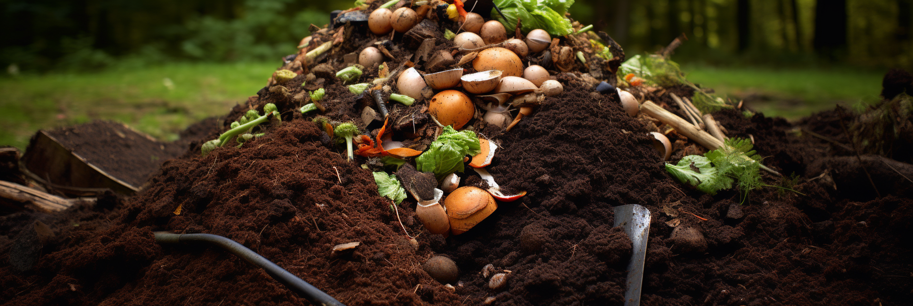

# 3 principles for successful composting

It is easy for newcomers who do not know much about composting to misunderstand this work, thinking that they just need 
to put the composting materials together and let them "fend for themselves", but do not realize that composting is also 
a technical activity. If you want to produce organic compost that is conducive to plant growth, there are three necessary 
principles you need to master.
<!-- truncate -->
## 1. Microbial bacteria

Composting will fail?

In fact, no matter what, nature will break down most of the materials.

The so-called successful composting means that the decomposition process is controlled. Not slow enough to see no change;
nor fast enough to decay into a pile of nasty things that emit a bad smell and attract mosquitoes.

Composting, in fact, is the use of a variety of microbial bacteria, a variety of compost materials (such as food waste)
into small molecules of nutrients, easy for plants to absorb.

Therefore, the most important work of composting is to create a good living environment for microbial bacteria. 
Like human beings, bacteria need food, water and air to survive. By "creating a good living environment for bacteria", 
we mean providing food, water and air to bacteria in a "balanced" way.

GEME is a real organic waste composter that uses the principle of bio-composting by providing the most suitable environment
for [GEME-Kobold](https://www.geme.bio/geme-kobold) (high temperature resistant complex microbial flora) to accelerate its reproduction and decomposition,
and to rapidly decompose biological waste into organic compost.

## 2. Balanced nutrition

Microorganisms absorb 1g of nitrogen per about 25g of organic carbon consumption, so suitable for composting carbon to 
nitrogen ratio between 20:1 to 30:1.

Carbon to nitrogen ratio exceeds this range, such as carbon to nitrogen ratio is too high will lead to a large loss of 
organic matter, not easy to fully decompose, it will be applied to the soil, easy to cause soil nitrogen deficiency; 
such as carbon to nitrogen ratio is too low, excess nitrogen will be released in the form of ammonia, emitting an 
unpleasant smell, pollution of the environment and loss of nutrients, so the configuration of compost materials 
"meat and vegetarian with" ( The ratio of carbon to nitrogen） is very important.

The "meat" refers to the nitrogen element; nitrogen is the element that constitutes the protein and DNA in all living 
organisms, and is indispensable for plant growth, as well as for soil microorganisms. The microorganisms that play a 
role in fermentation during the composting process need sufficient nitrogen to multiply. Green waste (e.g., discarded 
vegetables, cut fresh grass, etc.), livestock manure and soybean meal all contain high levels of nitrogen and are ideal
sources of nitrogen for composting.

"Carbohydrates provide energy for the fermentation of microorganisms, and the remaining carbohydrates form complex 
organic compounds that contain nitrogen, phosphorus and other essential plant nutrients, which are the main constituents 
of organic matter in organic fertilizers. Brown waste (e.g., straw, rice hulls, wood chips, leaf litter, hay, paper, etc.),
crop residues and agricultural processing waste are the main carbon sources for composting.

We can also use an intuitive way to distinguish between the two: as long as it is put for a long time is not likely to 
change things, is rich in "carbon" materials, such as straw, rice hulls, wood chips, fallen leaves, paper ...... and the 
like; if a little not long will begin to rot and smell things, is rich in "nitrogen" materials, such as fruit, fish, meat,
food waste, excrement ...... and so on. food waste, excrement ...... and so on.

Some materials have a carbon to nitrogen ratio very close to 30:1 and are very suitable for composting, such as: aquatic
plants, freshly cut grass, herbivore excrement, Chinese medicine residue ......, etc.

## 3. Suitable environment

Composting process is a process of rapid and massive multiplication of microorganisms, in addition to providing "meat 
and vegetable" food for microorganisms, it is also necessary to provide a suitable environment for growth and reproduction,
including temperature, humidity, pH value and oxygen content. Conventional composting environment parameters can refer 
to the following values.

- Moisture content (40%-65%)

- Oxygen content (5%-15%)

- Temperature (45-65°C)

- PH value (6-9)

To control these values, it is very important to turn the pile into daily management. For example, when the compost is 
in a significantly hot stage, it means that the microorganisms are growing rapidly and are at the peak of fermentation 
and decomposition work, and are in need of a lot of oxygen . At this time, by turning the pile frequently, you can let 
the air enter inside the compost material and help the microorganisms to multiply.
