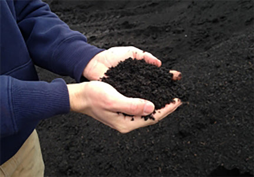

# 10 Things New Composters Must Know - How to Get Quality Compost

1. Place the compost pile on bare ground in a location that is shady and protected from the wind. Do not place the 
compost pile on rocks, concrete or asphalt, or in a pit. The compost pile needs to be based on soil that is accessible 
to worms and other microorganisms.
<!-- truncate -->
2. Loosen the soil for the chosen area and spread a layer of coarse-grained material about 10-20 cm thick, followed by 
a layer of well-mixed small granular material such as leaves, food waste, etc. Only a thin layer of grass clippings 
or a mixture of grass clippings and other materials should be spread; in addition, dry or wilted grass clippings 
should be selected to prevent them from rotting.

3. The materials for making compost must be thoroughly chopped and well mixed; the more types of starting materials, 
the better.

4. Add a few shovels of common garden soil or finished compost to the new pile as an "inoculum" and, if necessary, add 
compost worms. Onion peels, coffee grounds, tea bags or tea leaves are ideal food for worms.

5. Microorganisms need moisture, so compost needs to be kept moist.

6. Do not over-water the composting material as this will result in insufficient air and create an anaerobic environment. 
An anaerobic environment will terminate the composting process and anaerobic digestion will take its place. The 
composted material should be kept as moist as a wrung out sponge.

7. Waste such as meat, bones and cooked food will attract vermin and should be disposed of in the organic waste bin and 
should not be used for self-composting.

8. Make sure composting materials are well ventilated by.

- Mix well with coarse-grained material.
- Compost bins should have enough ventilation holes
- Do not use containers that are closed on all sides.

9. Turning the compost pile 
Turning can speed up the decomposition process by mixing the material more fully and replenishing the
gas. During the turning process, the finished product can be sieved and the undecomposed portion put back into the pile.

10. Cover the finished compost pile with wood, a thick layer of leaves or similar material to prevent moisture and 
nitrogen loss! If the compost pile is not adequately aerated, it can produce unpleasant odors.
