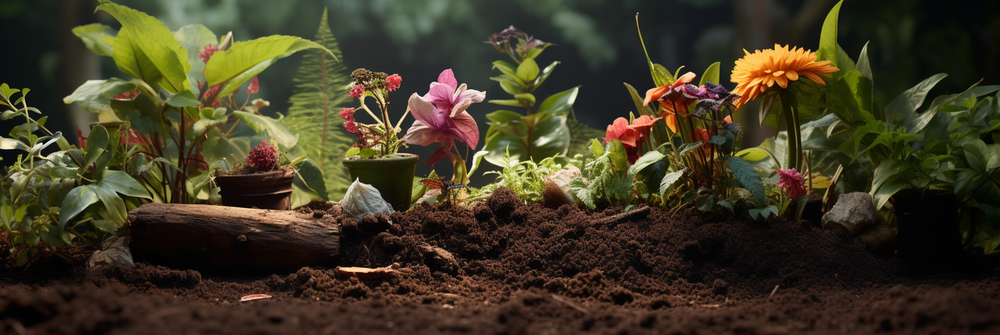

# Complete composting material list

Any substance that contains biodegradable carbon can be used to make compost. However, not all substances are suitable 
for making your own compost in your home garden. The following is a list of materials that are suitable as well as 
unsuitable for home composting.

<!-- truncate -->
## Suitable materials

### Grass clippings

When adding grass clippings to a compost pile, it should be noted that grass preferentially absorbs nitrogen from the 
soil, meaning that when the grass is well fertilized, the nitrogen content of the grass is also high. Grass also stores 
water in its cells, and when combined with nitrogen, the heat of the grass clippings increases significantly, and the 
resulting heat can even cause the pile to spontaneously combust.

Because of its fragile structure and high nitrogen content, grass will easily decay and release an unpleasant odor. 
The process of grass decay also produces and releases methane into the atmosphere, a greenhouse gas that can contribute
to climate warming.

To avoid this decomposition process, grass clippings should only be spread in a thin layer on top of the compost pile 
after air-drying or mixed with other structurally rich materials: such as leaves, shredded hedge branches and leaves, 
and fresh wood chips.

### Leaves

Leaves are one of the most important composting materials in the garden.

#### Some types of leaves can be more difficult to decompose, such as

- Oak leaves
- Chestnut leaves
- Poplar leaves
- Birch leaves
- Sycamore leaves
- Beech leaves
- Walnut leaves
- Walnut leaves
- Spruce leaves
- Spruce leaves
- Acacia leaves

These types of leaves (especially oak leaves) release tannins that cause compost acidification during decomposition, so 
the addition of lime or clay minerals (bentonite) can be very helpful.

#### Leaves that are easy to make compost from

- leaves of pear and drupe fruit trees
- Maple leaves
- linden leaves
- Willow leaves
- Ash leaves
- rowan leaves
- alder leaves
- Common hazel leaves

### Shredded tree and hedge branches and leaves

This material can be cut with a garden trimmer or shredder and added to the compost pile for better aeration.

### Food waste

- Fruit and vegetable waste
- Coffee and tea filters
- Egg shells

## Materials to be used in moderation

### Tropical fruit peel

In order to ensure that tropical fruits are transported remain in good shape, they are treated with germicidal substances
(fungicides). These chemicals are biodegradable and in small amounts do not interfere with the decomposition process. 
Therefore, the presence of small amounts of fungicides has little effect on the compost overall.

### Paper and cardboard

Small amounts of newspaper or kitchen paper used to hold food waste are easily decomposed and can be used for composting. 
In principle, paper and cardboard are biodegradable and decompose during the composting process.

However, some paper materials often contain components and additives that are not suitable for use in soil. The use of 
waste paper recycling systems allows for better recovery of large quantities of paper products such as printed paper like 
newspapers, and cardboard including egg cartons and trays of fruits and vegetables.

### Bedding for small animals

For sanitary reasons, only bedding for small herbivores can be used for composting, provided it is plant-based 
(e.g. wood or straw bedding).

All available granular bedding is not compostable. Unless these bedding materials are specifically stated to be 
biodegradable, they should be placed in the black residual waste collection bin.

Bedding from animals such as rabbits, hamsters, and birds can be used for composting, but the bedding and manure should 
be well mixed with other composting materials. Pet droppings can be added to straw and wood composting materials to add 
additional nitrogen supply.

For sanitary reasons, bedding and excrement from dogs and cats and all other carnivores should not be used for composting.

### Wood ash

A small amount of wood ash from the burning of natural wood can be added to the process of making compost to supplement 
the mineral content. Wood ash should be well mixed with other materials.

Large amounts of wood ash should not be used in homemade compost, as the accumulation of heavy metals in wood ash can 
also lead to increased levels of heavy metals in the compost.

## Materials that should not be used

Diseased plant parts (should be placed in the organic waste bin)

- Invasive plants such as ragweed, hogweed/windbreaker (should be placed in the organic waste bin or even the black residual bin); see "Prerequisites for making compost (decomposition)" for details
- Glass, metal, plastic and composite materials
- Oil and paint residues
- Construction waste and mortar
- Furnace ash
- Drainage ditch sludge
- Vacuum cleaner bags
- Lawn clippings treated with herbicides (compound products)
- Treated wood and particle board
- Diapers
