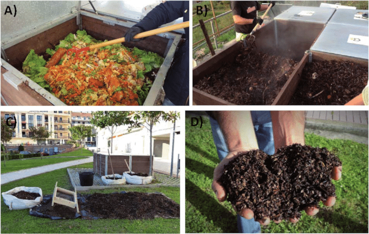

# You have garbage? I have the method! A complete list of different bio-waste composting methods

n 2020, only the EU produced a total of 225.7 million tons of municipal waste, of which up to 50% of municipal solid
waste is biological waste.

In the European Union as a whole, about 118 to 138 million tons of biological waste are produced each year (2020). 
Therefore, biological waste plays an important role in recycling and a new circular economy.

However, in Europe, the level of classified collection and treatment of biological waste varies greatly. Many countries 
are far from being able to make full use of biological waste. The implementation of an independent biological waste 
collection and treatment system is sometimes a long and complex process that requires a fully coordinated policy framework
and significant financial support.

When faced with serious greenhouse gas emissions and continued global warming, environmental protection is so important
to each and every one of us, each and every family. If we can start from the small things around us, reduce food waste 
as much as possible, and recycle the waste in our life through different forms of composting, this is certainly a good 
way to physically protect the environment and reduce emissions.

In this series of articles, we will introduce you to different composting methods for bio-waste that you can easily do 
at home.

- [Composting food waste in less than 24 hours is no longer a dream](/blog/composting-food-waste-in-less-than-24-hours-is-no-longer-a-dream)
- [How to compost garden waste](/blog/how-to-compost-garden-waste)
