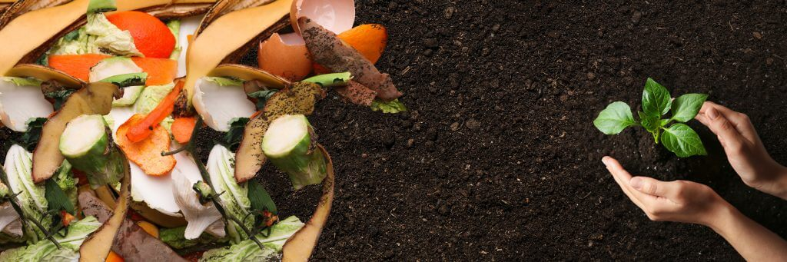

# Composting food waste in less than 24 hours is no longer a dream

We all know that when making compost, kitchen waste should be separated from garden waste. This is because kitchen 
waste can attract rats and other city pests! Therefore, we need to use a safer or "protected" system for this type of 
composting.

<!-- truncate -->

## Burial composting method

Bury plant-based kitchen waste at least 8 inches below the soil. This composting method takes 6 months. The location of
each burial must be kept in mind. It is important to remember the location each time you bury your compost because 
it must be buried in a different place each time you make it! This is a great way to reuse organic materials and improve 
your garden soil. Please bury your food well to avoid rodent infestation.

## Digester composting method
Another option is to make your own food scraps "digester". Simply drill holes in the sides and bottom of a steel garbage 
can, bury half of it in well-drained soil, and then place plant-based food waste in it every week. Insects, earthworms 
and other microorganisms in the soil can reach the food scraps through the holes and gradually decompose them, 
leaving you with a good compost in 8 to 12 months. Remember to keep the lid closed after each use to keep rodents and 
other animals out! The advantage of this method is that once it's in place, it's as easy to use as a regular garbage can!

## Worm bin composting method
There is another popular way to make compost from food waste: the worm bin. You'll need red earthworms (different from 
those found in gardens) and a strong, not airtight, container. Put in the worms and some moist bedding material (shredded 
paper or leaves will do), set up the box, and bury a small amount of kitchen waste under the bedding. Feed the worms with 
food waste once a week. Over time, you will see the food waste and bedding disappear and become a rich compost pile. 
The worm bin requires the most work, but the quality of the compost is excellent and the process is a lot of fun.

However, none of the above methods can turn food waste into compost within 24 hours and there are strict restrictions on 
the types of food waste that can be composted, only green waste that is in food waste can be put in.

Isn't there a good way to compost food waste within 24 hours?
The answer is yes, and that is the GEME bio-composter.

## GEME microbial decomposition rapid composting method

This is the first home composter that uses the same technology as the Mars Habitat program, using pure natural high 
temperature resistant microbial flora to accelerate the decomposition of food waste by providing the microbial flora 
with a suitable environment for reproduction and decomposition in a completely restored natural composting process, 
decomposing food waste into 5% highly active organic compost and 95% clean air in 6-8 hours.

Unlike other equipment in the market, it does not turn the bio-waste into dehydrated scorched waste by grinding and high temperature, but claims to be an organic composter; it is a bio-waste composter that really adopts bio-composting technology and decomposes the bio-waste into organic fertilizer by microbial decomposition. Its whole technical process and microbial strains have been proven for many years, and it is a reliable and effective biological fast composting technology.

So with [GEME](https://www.geme.bio/product/geme), making food waste into compost within 24 hours is no longer a dream, but a reality.
