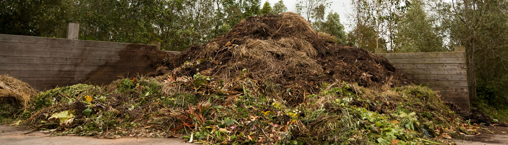

# How to Compost Garden Waste

First, mix approximately the same weight of green garden waste (i.e., cut grass) with brown waste (i.e., dead plants).

Once the material is well mixed, chop it up as much as possible to speed up the composting process. You can use a 
machete or sharp shovel, or a lawn mower to press over the mixture. Or you can put the mixture in a metal bin and chop 
it up with a weed whacker. The smaller the material, the faster it will break down.

Then, add some water to the mixture. At this point, squeezing the mixture should feel like squeezing a sponge. You can 
grab a handful and try it out.

Pile all of this material in the area where you plan to make compost. You can also use a compost bin, but this is not 
necessary. The main purpose of the bins is to keep the composting process neat and moist.

The compost should be stirred once a week, which is called "turning" the compost. If necessary, add some water to keep 
the compost moist. This will allow sufficient oxygen and water to be brought to the different parts of the compost pile 
to facilitate the decomposition process.

After completing these steps, the compost pile will be finished in just 8 weeks.

Don't want the hassle of piling and chopping again? No problem! You can make compost by simply piling up organic materials,
keeping them moist, and letting them decompose slowly. Although it takes longer (at least a year), all organic materials 
will eventually break down into compost, so you just have to be patient and you'll be able to make compost successfully.

If you want to get compost faster, you can put organic compost that has been quickly decomposed by GEME into the compost 
pile of your garden waste and mix it well. This GEME-Kobold enriched organic compost will speed up the decomposition of 
your garden waste and improve its nutrient content, allowing you to harvest your highly active organic compost as fast
as possible.
