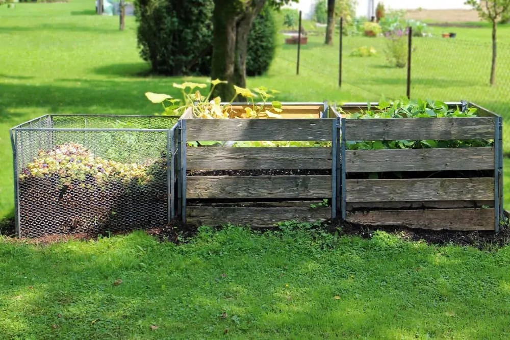

# Composting Tips All Explained

The key to making compost is to create excellent living conditions for aerobic microorganisms to create excellent living 
conditions. Only with the help of these microorganisms is it possible for organic waste to be decomposed without 
producing odor.

It has been proven that, although it is not necessary to follow a formula, it is important to follow a certain number of 
rules.

- [Prerequisites for successful composting](/blog/prerequisites-for-successful-composting)
- [Material crushing is crucial](/blog/material-crushing-is-crucial-for-fast-composting)
- [Mixing multiple materials is one of the keys to successful composting](/blog/mixing-multiple-materials-for-composting)
- [Is it necessary to use additives?](/blog/is-it-necessary-to-use-additives-for-composting)
- [How to build my compost pile](/blog/how-to-build-compost-pile)
- [Surface composting and mulching](/blog/surface-composting-and-mulching)
- [Making compost from leaves](/blog/making-compost-from-leaves)
