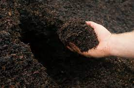

# Prerequisites for successful composting

Composting is a biological process. In order to initiate and accelerate the process of composting, it is necessary to 
improve the living environment of the microorganisms involved in the process of composting, and therefore it is necessary 
to take into account the specific needs of these microorganisms. The following factors are particularly important.

## Water 

All microbial activity requires water. When water is lacking, many microorganisms go dormant, which slows down the 
decomposition process. Therefore, when making compost, it is important to ensure that the compost material is well hydrated.

If it does not rain for a long time and the amount of garden waste to be decomposed is large, then the compost pile needs 
to be hydrated to ensure that it is sufficiently moist.

During the process of making compost, heat production causes moisture to evaporate, so an active compost pile may need 
to be re-hydrated.

However, too much moisture (soaking) can also hinder aerobic activity. Excess moisture impedes aeration and compost pile 
cooling and therefore may lead to anaerobic digestion.

Therefore, the compost pile should be covered during very wet weather conditions, for example during rainy days. 
This is especially important when the compost pile has just been erected, when the composting has not yet been completed or when the compost container has not yet been filled.

## Air 

Air contains the oxygen necessary for the respiration of aerobic microorganisms. Anaerobic microorganisms that do not 
need oxygen can multiply if the compost material is not adequately ventilated, for example in closed containers or 
concrete waste pits, if the material pile is too dense, or if there is moisture accumulation.
These conditions cause the composting process to stop and anaerobic digestion to begin, followed by harmful and unpleasant
side effects such as the release of odors (hydrogen sulfide (H 2 S), ammonia (NH 3 )) and the production of climate-damaging
gases, methane (CH 4 ) and nitrous oxide (N 2 O).

## Heat

To ensure good air circulation, the composting material should contain a sufficient amount of coarse-grained, well-structured 
material. In addition, containers with good air permeability and good drainage should be used. In order to allow air into 
the compost pile, the width of the pile should not exceed 2 m and the height should not exceed 1.5 m. Turning the pile not 
only improves the air permeability of the compost, but also allows a better mixing of the compost material.

Microbial performance is at an optimal level when optimum moisture and aeration are maintained, which will be reflected 
in the dramatic warming of the compost. Higher temperatures will also accelerate the decomposition process. To destroy 
pathogens and weed seeds, compost piles need to be maintained at 55-60°C for an extended period of time. Compared to the 
process of making compost in a professional composting plant, the process of making homemade compost in the garden usually
does not reach such temperatures or does not maintain this temperature for the required time. Therefore, when making 
homemade compost in your own garden, you should not add diseased plant parts or seeds of harmful plants (such as weeds 
or invasive plants)

## Nutrients (starting material)

The starting material should be as rich as possible and have an appropriate ratio of green waste to brown waste. 
It is the basis for ensuring the final nutrient content of the compost.

## Misc 

The easiest and most efficient way to compost - the [GEME home composter](/product/geme)

:::info
If you are using a GEME home composter, then you will be happy to see that there will be only one thing for you to do, 
and that is to just throw your bio-waste in whenever you want and harvest your organic compost after 6-8 hours.
Because this is an intelligent, user-friendly device with a built-in sensor chip that will help you automatically adjust 
the temperature and moisture; the pre-blended GEME-Kobold microbial agent contains a tuning material that adjusts the
carbon to nitrogen ratio of the initial material for you, you don't need to focus on the type and amount of waste you 
put in, or worry about odors, flies and rodents.
It's as simple as that. Technology makes your life better!
:::
