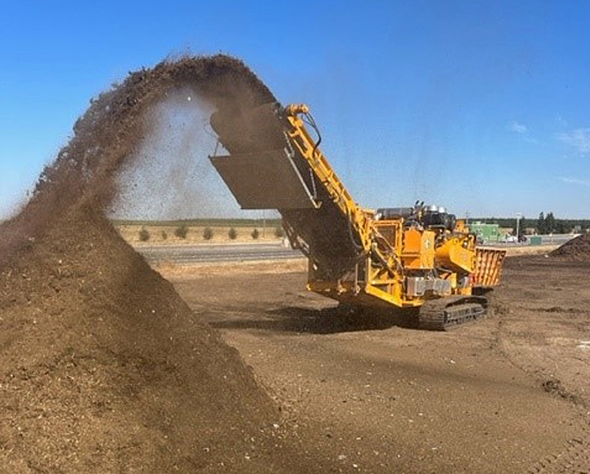

# Material crushing is crucial for fast composting

In order to accelerate the decomposition of the starting material, we have to shred particularly hard and bulky organic waste.
<!-- truncate -->
The shredded woody material can be used as structural material to improve the permeability of the compost pile.

Shredded woody material combined with soft plant material can make the compost pile loose and airy.

Since twigs are not available at all times of the year, one or more bags of twig material can be collected, 
shredded and saved, and used in conjunction with soft plant material (e.g., grass clippings) when appropriate.

For woody material, it is best to use pruning shears to cut all the material you can handle into pieces about 5 cm long,
if possible, when it is not dry.

You can easily do this if you use a sturdy old cutting board or a lightweight axe, or, of course, a garden shredder.

We should chop or split thicker stems, such as those of sunflowers or dahlias, in order to facilitate microbial decomposition.
