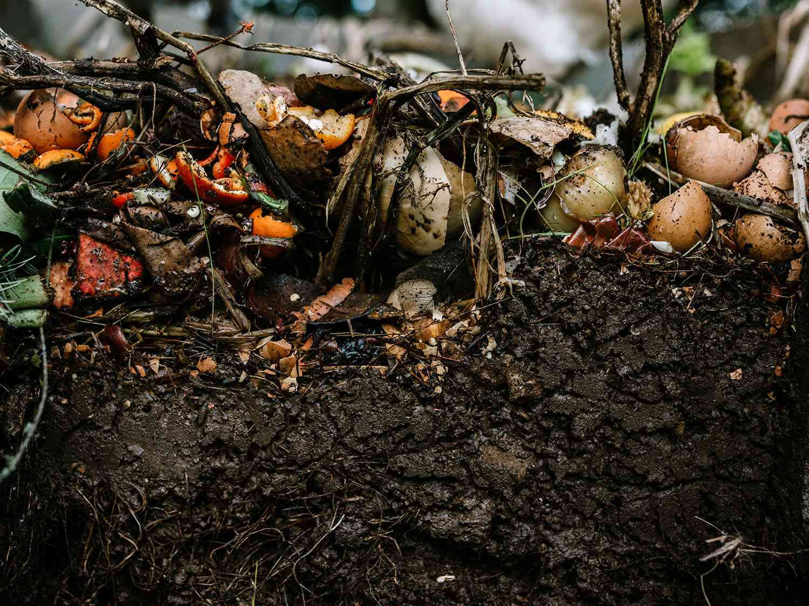

# Mixing multiple materials is one of the keys to successful composting

The more diverse the mixture of organic waste, the better the decomposition process and the higher the value of the 
final compost pile. It is possible to either build up the compost pile layer by layer or gradually mix together the 
available materials on hand. The only important thing is to avoid adding large amounts of the same material to the 
compost pile at once, for example, adding only leaves or grass clippings.

The structure of the compost pile is determined by the amount of waste that is generated more or less continuously 
throughout the year. Almost everything biodegradable produced in the garden and indoors can be used to make compost, 
and in the case of insufficient quantities of different types of waste, the structure of the compost pile can be improved 
by mixing other substances. For example, coarse material left after the compost has been sieved (material filtered out 
by a screen) or other crushed material can be put back into the compost pile.

Peat should be avoided. Peat tends to lock in moisture, so when the compost pile becomes too dry, the remaining moisture 
is held in the peat rather than being available to the small organisms in the pile. In addition, it should be remembered 
that peat extraction can pose a threat to wetlands, so it should be avoided for ecological reasons.
