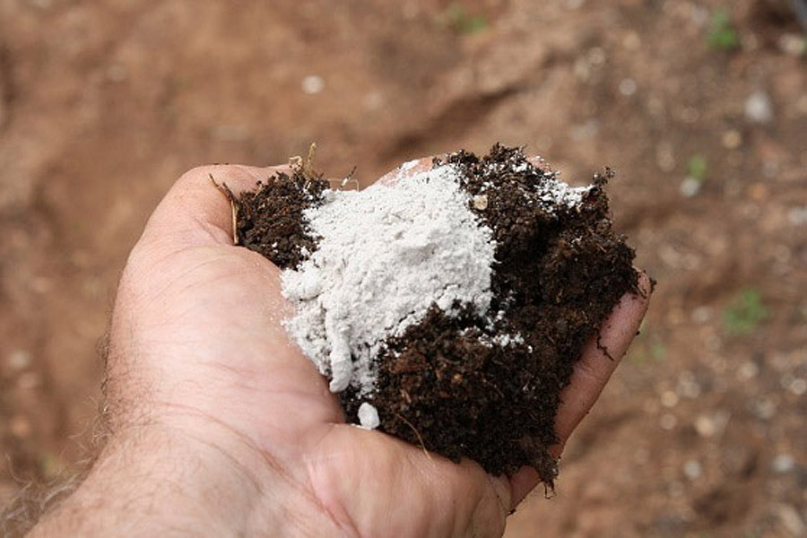

# Is it necessary to use additives to compost?

If the composting material is a mixture of food waste and garden waste, there is no need to add any additives.
The success of composting depends on the richness and diversity of the materials used, i.e., the materials should be 
coarse and fine, soft and hard.

<!-- truncate -->

To allow optimal decomposition to begin within a few days and to maintain it until the compost is mature, add a few 
shovels of finished compost, sieved material or garden soil to the compost material. The small organisms and microorganisms 
contained in the finished compost or garden soil can be used as an "inoculant" for the new compost so that we do not need
to buy so-called "probiotics".

Commercial composting additives such as compost starters, accelerators, lime, rock dust, bentonite and fertilizers are 
also not needed when compost is made correctly, i.e., when a diverse and structurally rich mix of organic wastes is used. 

This is because additives usually do not guarantee the success of composting and do not fix serious errors that occur 
during compost making.

