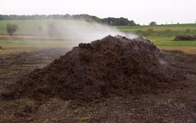

# How to build my compost pile?

## Compost pile

Not all locations in the garden are suitable for making compost. If possible, the compost pile should be set up in a 
shady part of the garden to prevent the compost pile from dehydrating.

Extreme weather conditions can discourage composting, so the location where the compost pile is located should be surrounded
by a hedge, bean stand or wall planting to prevent it from being damaged by strong winds.

The location must be easily accessible and require sufficient room to move for turning the pile, etc.

Compost piles should not be erected on impervious surfaces.

Stone and concrete floors can prevent worms and other beneficial organisms from entering the pile. Water can accumulate 
at the bottom of the pile and cause decay.

A layer of wire mesh on the ground will prevent rodent infestation.

Compost piles should not exceed 1.5 meters in height and 2 meters in width at the bottom. The length of the pile depends 
on the available space and the material to be composted.

First, loosely pile coarse-grained materials to a height of about 20 cm. Chopped tree poles and hedge clippings, branches, 
stems and flowers of perennial plants are suitable materials, which provide drainage for the compost pile and allow excess 
water to escape while ensuring air circulation.

Next, spread organic waste from the garden and kitchen; sprinkle some finished compost or soil everywhere, and cover the
main material with a very thin layer; the material should be watered occasionally in small amounts to prevent the pile 
from drying out too much. Stack the materials as described above until they are 1.5m high.

The top of the compost pile is not raised like a mountain peak, but is flat.

The compost pile should be covered with a protective layer of grass clippings, reed mats, leaves or straw; to speed up 
the decomposition process, the pile can be turned after about 3 months; if the compost pile is too wet, it should be 
turned sooner.

When using a heated compost bin, it is important to note that compost worms can escape when the temperature exceeds 25°C.

## Compost bins

In a small garden, it is sometimes difficult to find a suitable place to build a compost pile. The easiest solution is to 
drive wooden stakes into the ground and stick the planks on either side. It is important to note that, depending on the 
width of the boards, a space of 1-3 cm should be left between them to ensure adequate air supply.

A good and inexpensive solution is to use compost bins made of wooden boards, which are sold in every hardware store. 
You can go for two or three of these, which will.

- better mix the material
- Store single batches or coarse structured materials
- Better turning of the pile (transfer from one compost bin to another)

Crate racking bins with extra large voids and containers made of wire mesh tend to dry out the compost material too much 
and are therefore not recommended.

An alternative to crate composting is plastic bin composting. Plastic bins are closed at the top and sides and open to 
the ground like other compost bins.

The principles of composting in plastic bins are the same as for composting in open conditions. The moisture content and 
air supply must be more carefully regulated, because the basic closed design may lead to material spoilage; to avoid 
spoilage we need to mix some coarse grained material during the loading process.

## Fast composter

Another option is the hot composter, also called the "fast" composter. Depending on the type and construction, these 
machines are insulated and have precise ventilation. The insulation prevents the heat generated by decomposition from 
being released too quickly to the outside area. These composers provide higher composting temperatures, ensuring continuous
decomposition even in winter, and speeding up compost production.

The [GEME](/product/geme) is such a fast bio-waste home composting bin. It is simple to use and allows your bio-waste to 
degrade quickly by providing an optimal environment for microbiota to multiply and decompose. No matter how the 
environment changes, the flowers and vegetables in your garden and the potted plants in your home can always enjoy the 
highly active organic compost.

Your kitchen will also be free from odors and flies. The high decomposition reduction also allows you to clean up the 
organic compost after waste decomposition only once every few months, or even once a year. Spend more time with your family 
and enjoy the convenience of green living!
