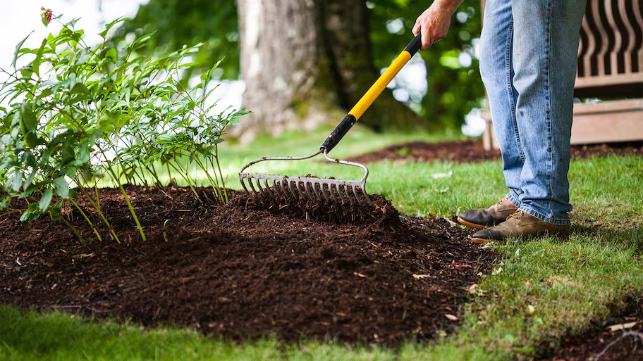

# Making compost from leaves

A special type of organic waste utilization is surface composting and mulching. Instead of transporting dead plant branches
or leaves to the compost pile, they are evacuated directly and evenly on site. This is very labor efficient when larger
areas of land are involved, as there is no need to reuse the finished compost. The material used for surface composting
is tilled beneath the soil, while the material used for mulching remains on the soil surface. For densely cultivated gardens,
mulching with organic material is easier than with surface composting, which is recommended prior to the placement of a new garden.

Many organic wastes can be used for surface composting, such as leaves, pruning debris from perennials, grass clippings,
vegetable residues, wild herbs without seeds, and straw. The greater the variety of materials, the more nutrient-rich
the compost layer will be.

Pruning debris from woody perennials should only be used when finely chopped because the 3-5 cm high layer of compost
does not warm up as much as a compost pile and therefore decomposes more slowly.

In the mulch layer, microorganisms and worms are able to flourish, which are necessary elements for the conversion of
plant material into humus, which in turn makes the soil fertile. The more microorganisms in the soil, the faster the
mulch layer decomposes, thus providing minerals to the plants.

This permanent ground cover protects the soil, similar to a mixed conifer forest, from wind, heavy rainfall leaching and
dewatering in the sun. Under the mulch layer, the soil can remain moist and loose.

