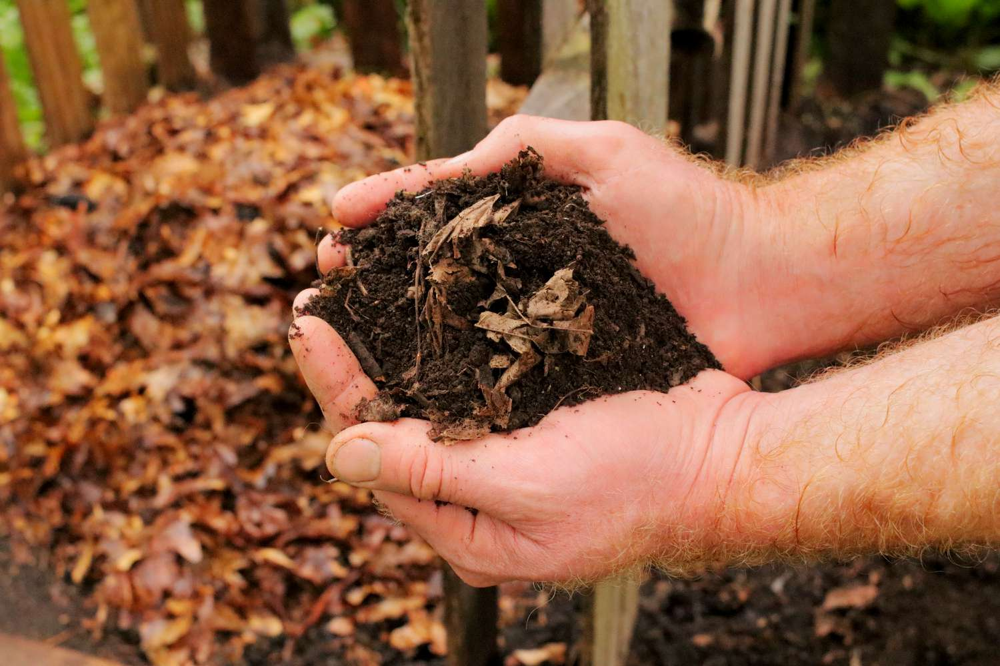

# Making compost from leaves

If you have broad-leaved trees in your garden and have enough space, you should make compost from leaves in autumn.

Lay out a leaf pile of about 6 cubic meters in the style of a triangular pile, 4-5 meters long at the bottom and 2 meters
wide. Lay it in layers, each layer 20 cm high, with the highest point in the middle at a height of 1.5 m.

Microorganisms need nitrogen to reproduce, which means that they need nitrogen to form unique proteins, and leaves contain
very little nitrogen.

Therefore, each layer of leaves should have a nitrogen-containing addition, such as adding fresh grass clippings
(sprinkle a thin layer) or horn clippings (a small amount, the leaves should still be visible). 

Spread garden soil on
both sides of the compost pile so that the wind does not blow the leaves away. 4-5 days later, the heat generated in the
pile reaches a peak of about 50°C. Over the next few weeks, the temperature drops to 25°C. 

The pile will shrink and become smaller because a large amount of carbon (C) is released into the air as carbon dioxide 
(CO2) or participates in the decomposition process with water. At this point, half of the compost pile should be placed 
on the other half to protect the rest of the pile from frost. 

The temperature of the compost pile will rise again to about 35°C and then will remain at about 15°C until March. 
The bacterial decomposition in the pile will continue until the compost-making is complete.

