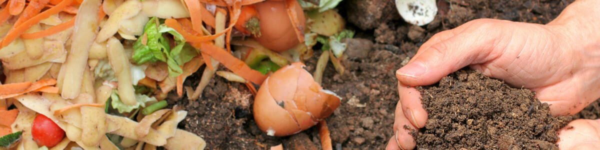

# Hygiene and safety of composting

Organic waste and compost piles are generally harmless to human health, provided we observe the basic principle: 
people with mold allergies and those with weakened immune systems should be careful. 
This means that such people should promptly throw organic waste from the kitchen into the organic waste bin and should 
not make their own compost at home. For healthy people, it is safe to make compost in their own gardens.

Scientific studies have shown that the use of compost can suppress soil-borne plant diseases (phytosanitary effects), 
but conversely, human and plant pathogens and weed seeds can be introduced into the soil by compost. 
Therefore, ensuring that pathogens as well as weed seeds are eliminated during the composting process is critical to human 
and plant health.

The heat generated during the composting process is particularly important for the destruction of pathogens and weed seeds.
Maintaining a high enough temperature over time, combined with the proper moisture content, can kill pathogens and weed seeds.

The process of making homemade compost makes it difficult to reach the temperatures required for decomposition and to 
maintain the required temperatures for a long enough period of time because relatively small compost piles will not be 
heated sufficiently due to their unfavorable surface area-to-volume ratio. 
As a result, smaller compost piles are not effective in killing many human, animal, and plant pathogens, as well as weeds 
with seeds and their rhizomes.

Therefore, the corresponding plants and their plant parts should be disposed of in a more appropriate way:in the organic waste bin.

But perhaps what you don't know is that in this regard, GEME has shown unparalleled strengths.

Biological waste, especially food waste, is rich in protein components and is a good organic fertilizer raw materials, 
but they are also perishable, easy to produce, and mix a lot of pathogenic bacteria and insect eggs, weed seeds, 
and other harmful substances, so most of the biological waste you see will be foul smell and sewage flow.

In the circulation system under the operating condition of GEME, bio-waste is fermented and dried under the action of 
[GEME-Kobold](/geme-kobold) under the condition of rapid heating to 75 ℃. As bio-waste is exposed to aerobic high temperatures, 
various pathogens that may exist in this environment are killed, and the harmfulness of its fermentation products has been removed.

However, under high temperatures, most microorganisms are killed like any other bacteria.

This is where GEME-Kobold, the world's only discovered and proven high-temperature resistant complex microbomb to date, stands out.

GEME-Kobold is activated and turned on for degradation at 75-80°C. While other pathogenic bacteria or microorganisms are 
killed by high temperatures, it becomes more active. It ensures not only the activation of organic fertilizer production 
but also its hygienic condition.

This advantage is something our competitors will never be able to match.

The by-product of the short drying and datering waste treatment plant is burnt waste.

Other similar biological waste treatment plants have never dared to produce data on the nutritional and hygienic 
properties of the by-product.

GEME does, and the by-products from the decomposition of bio-waste by GEME-Kobold have been proven by numerous facts and 
scientific data to be high quality organic fertilizers, hmic acid soil conditioners and wastewater purifiers.

So, feel free to use it to harvest your organic vegetables, fruits and flowers.

So even if you are mold allergic and have a weak immune system, you can still compost and grow your dreams with [GEME](/), 
and you can still reduce your carbon footprint and start living an easy and enjoyable green life with GEME.

