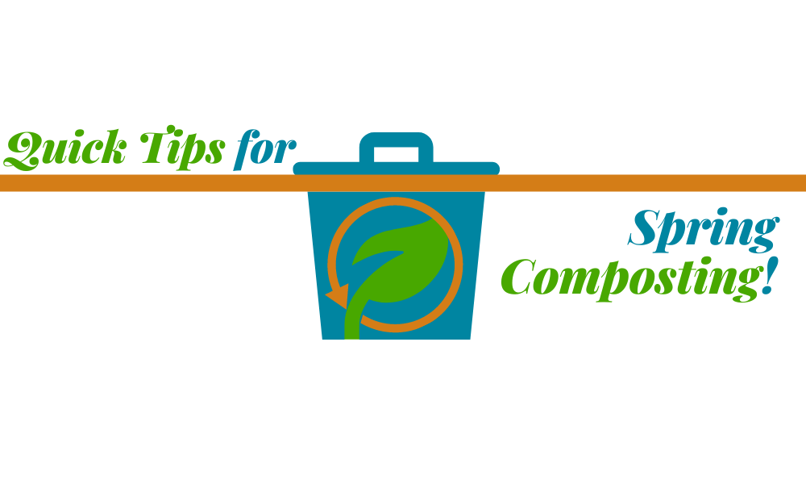

# A few important tips about composting

Why does my compost pile stink?

Why is my compost pile full of maggots?

Why has my compost pile turned my yard into a rat playground?

Why does my compost not look as good as expected after use, and do my plants get sick and even wilt?
<!-- truncate -->
If any of these questions arise in your composting journey, you will find the answers and solutions in the following articles.

- [How to avoid stinky compost pile](/blog/how-to-avoid-stinky-compost-pile)
- [Compost piles that make plants sick](/blog/compost-piles-that-make-plants-sick)
- [Rat-infested compost pile](/blog/rat-infested-compost-pile)
