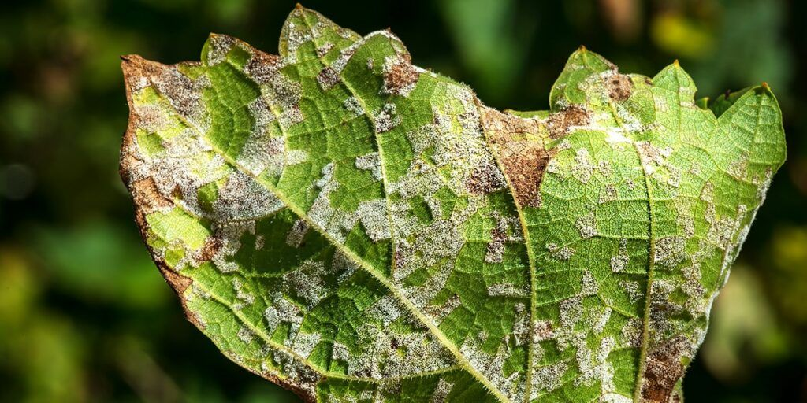

# Compost piles that make plants sick

Whether in the garden or indoors, plants should not be used for composting in your own garden once they have contracted 
a disease or suffered an insect infestation.

Pests such as lice, thrips, European red mites or maggots will only die when the compost reaches very high temperatures.
<!-- truncate -->
Likewise, diseases like powdery mildew on cucumbers and squash, downy mildew on lettuce or spinach, rust on geraniums, 
or black spot on roses, and their spores will not be sufficiently inactivated during the homemade composting process.

Do not make compost from the following materials.
- Cabbage with rhizoctonia
- Tomatoes and potatoes with blight
- Dead branches with coral blotch
- Apple branches, pear branches, berry branches, red and white hawthorn branches, and rowan branches with fire blight, etc.
- Bulbs and tubers with white rot
- Plants that die rapidly from wilt during the growing season, such as asters, strawberries and tomatoes
- Raspberries with wilt

Both diseased plants and infected garden plant waste should be placed in the organic waste bin or sent directly to a composting plant.

The causes of plant diseases include abiotic and biotic factors. Abiotic factors include freezing, sunburn, drought, 
drug damage, fertilizer damage, hail, mechanical damage, and environmental pollution; plant pathogens include fungi, 
bacteria, phytoplasma, viruses, virus-like, parasitic higher plants, and nematodes. Among them, fungal diseases account 
for 50-65%, viral diseases account for 10-20%, and bacterial diseases account for 5-10%.

It has been proven that when you use organic compost made from GEME enriched with GEME-Kobold for your plants, 
the level of disease in your plants is greatly reduced.

GEME-Kobold has been proven to be safe for use in agricultural products. The organic fertilizer produced by the recycling 
of biological waste using GEME-Kobold increases and activates the microorganisms in the soil under the action of a variety 
of microorganisms. In this way, the soil becomes a clumps structure, and the water permeability and ventilation of the 
soil become better, which promotes the growth of crops.

In addition, while absorbing nutrients, the root hairs will excrete root acid. Because root acid is eaten by GEME-Kobold, 
it prevents root rot and crop aging.

And then, [GEME Kobold](https://www.geme.bio/geme-kobold) uses the carbon dioxide and organic acids produced by fermentation to dissolve the mineral components 
in the soil, which plays a role in conferring mineral components on crops. Crops grown in such a soil environment, 
in order to restore their original functions, kill diseases and pests in order to protect themselves, emit aromatic substances 
that cannot be approached, and realize production that does not rely on pesticides. So you no longer need to use herbicides 
and chemical fertilizers for your crops, and organic crops are produced in the most natural way and at the lowest cost.
