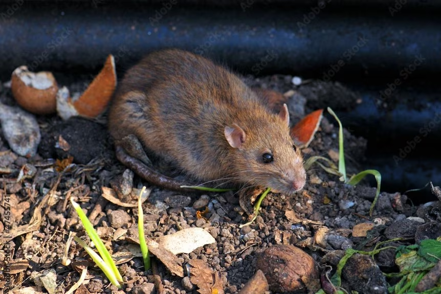

# How to avoid Rat-infested compost pile

Non-vegetable food waste (meat, sausages, fish scraps, bones) is not suitable for homemade composting in the yard, 
because the homemade composting process usually does not guarantee the required temperature for a certain period of time 
to ensure good composting hygiene (sanitary control of epidemics). 

Besides, for hygienic reasons, all cooked food waste should be discarded (in food waste bins) to avoid attracting rodents and vermin.

[GEME](/product/geme) can solve your above problems.

GEME is made for food waste, the intelligent control system creates the best composting conditions, 
GEME Kobold is able to break down most of the biological waste, so you don't have to worry about your food waste becoming 
smelly or useless, you can just throw them into GEME anytime and harvest your highly active organic compost after 6-8 hours.

GEME makes your life easier and more environmentally friendly.
