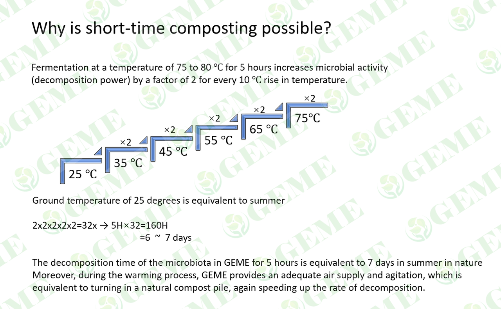

# When will the compost be ready to be made?

Fresh compost (= immature compost) can be made in about 3-4 months. The finished product can be used as a soil cover to 
improve the soil. It contains mainly some large granular material and some humus and many small organisms that can 
rejuvenate poor garden soils.
<!-- truncate -->
- Mature compost (= humus fertilizer) takes about 4-6 months if made during the warmer half of the year, otherwise it can 
take up to 6 to 12 months to complete after starting the composting process.

- A uniform, fine-grained structure, and moist forest soil-like odor indicate that the compost is made and ready for use. 
Compost is generally ready in this condition after 6 to 12 months, depending on how smoothly the composting process went.

- Compost should not be stored for more than one year because once the organic matter is excessively decomposed, the accumulation
of humus can be compromised.

The essence of composting is a dynamic process achieved by the interaction of multiple microbial communities with very 
rapid community structure succession. The initial heating and high-temperature stage can play a role in killing harmful
substances such as pathogenic pathogens, insect eggs, weed seeds, etc., but the main role of microorganisms in this process 
also includes metabolism and reproduction, while producing a small number of metabolites, which are neither stable nor easy 
to be absorbed by plants; after the cooling and decomposition period in the late stage of composting, microorganisms 
will carry out the humification of organic matter, and in this process produce a large number of metabolites that are beneficial 
to plant growth and absorption. Therefore, traditional composting generally takes 4-6 months.

If you compost with GEME, you will be amazed by the speed of composting. GEME creates the most suitable environment for 
microorganisms to multiply, it completes in 6-8 hours the composting process that in nature takes 4-6 months, 
it makes it possible to compost in short time. You can see the basic principles of short time composting in the table below.

