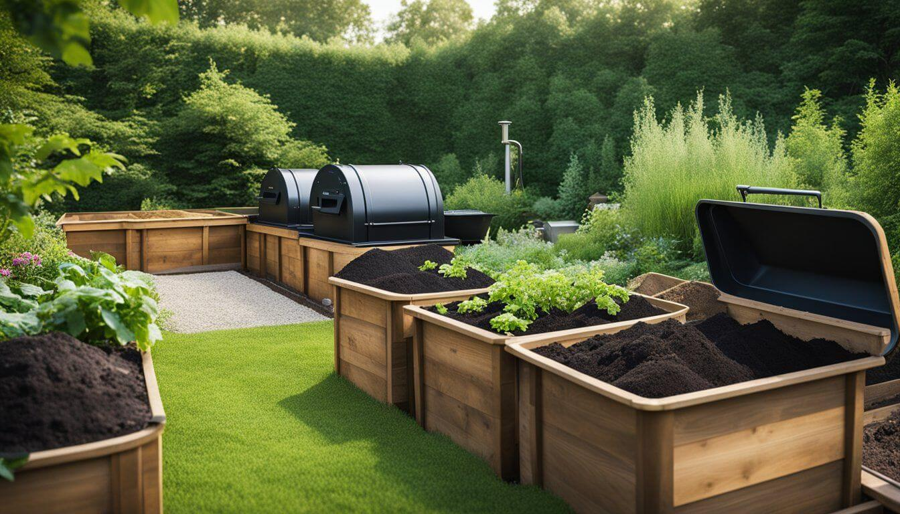

# How to test the success of composting

Watercress test to assess compost maturity and plant compatibility.

- Mix a small amount of compost with garden soil in a small container and moisten with water.

- Scatter watercress seeds over the mixture, cover them with plastic wrap, and place the container in a bright location 
out of direct sunlight to allow the seeds to germinate.

- If the seeds germinate after about a week and the seedlings grow rapidly without brown or yellow discoloration, 
the compost is mature and compatible with the plants.

- If seedling growth is sluggish or the leaflets are discolored, the compost is still not mature enough and should not be
used as potting soil, but only as a soil cover or for soil amendment.

One thing that has to be mentioned here is that GEME is a complete restoration of the natural composting process, 
where the biological waste is processed through the decomposition of an all-natural microbiota.
In contrast to other plants on the market that claim to produce organic compost by means of high temperatures and grinding,
GEME produces a real natural organic fertilizer, whereas those produce burnt waste that has been dewatered.

More to the point is that burnt waste is not good for your plants and the soil in your garden, it has a seed germination 
index GI close to 0, showing great toxicity to plant seeds and a failed product decay. The application of such products
on farmland will not only seriously affect soil quality and prevent normal plant growth, but also bring the risk of waste 
pollution transfer and surface pollution from storm water runoff. Nitrogen is wasted and the C/N ratio is too high. 
When it is applied to the soil, it will take away the nitrogen from the soil and make the soil fall into the state of 
"nitrogen starvation", which will affect the growth of crops.

we hope we can take care of people like you who are committed to environmental protection through really good products.
We look forward to seeing you take your little GEME home, it won't let you down.
