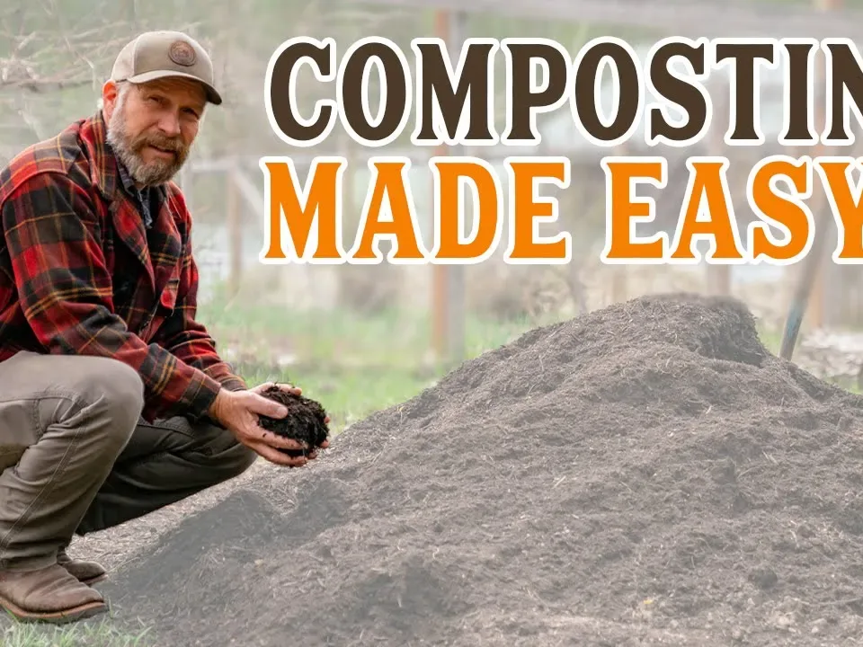

# 6 steps to make successful composting easy

Tips for Composting Success
1. Multiple organic wastes - improve microbial nutrition by mixing multiple substrate materials.

2. Large enough volume of waste to be processed - facilitates self-healing as well as improved sanitation.

3. Shredded brush and pruned branches - shorten decomposition time by increasing the contact surface area for microorganisms.

4. Regular loosening and turning of the pile - allows for adequate mixing of the various materials to improve ventilation
and reduce areas of anoxia.

5. Green waste as a structural material - coarse-grained materials create voids and improve aeration.

6. Covering the compost pile - prevents rain from bringing excess moisture and reduces the risk of over-fertilizing 
the soil under the pile.

Other than that, GEME is the most convenient and fast way to compost.
[GEME](/product/geme) is a true composter that uses [microbial fermentation](https://www.susupport.com/knowledge/fermentation/microbial-fermentation-simply-explained) methods to transform biological waste into organic compost quickly, 
odorless, and quietly. In just 6-8 hours, you can harvest highly active organic compost from your leftovers, expired food, 
and puppy poop. It's more convenient than regular garbage cans and easier to handle than natural composting. 

