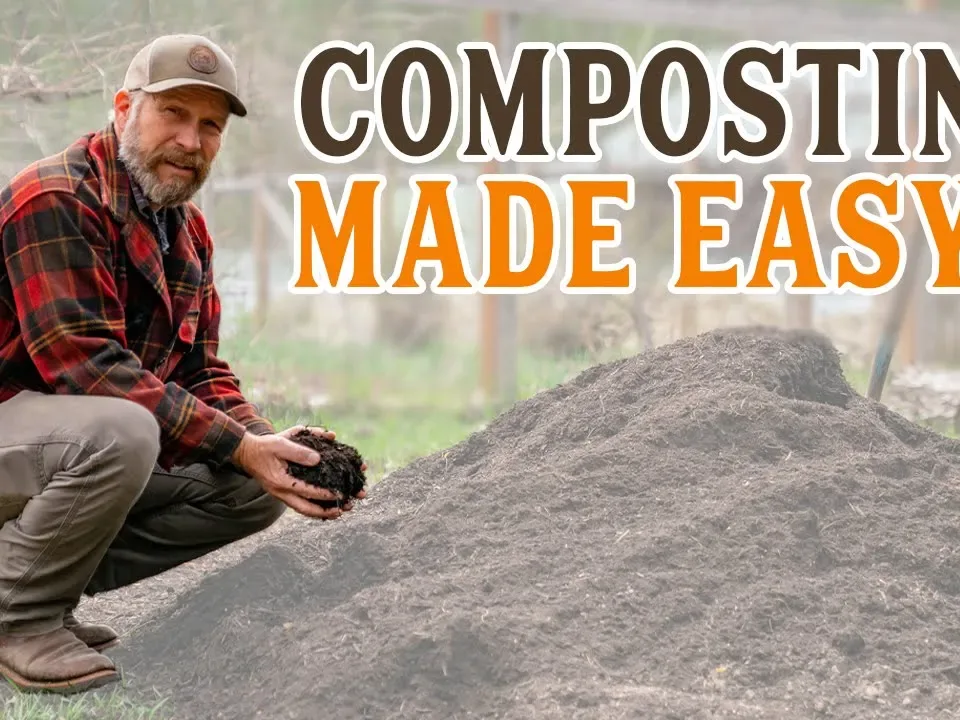

# How to use compost

After all the hard work and long waits, it's finally time to harvest your compost pile.
I'm sure at this point you are full of joy getting this amazing dark brown dirt to do their job.
So, do you know how to use compost?
Do you have any of the following questions about how to use compost?

<!-- truncate -->

## Where can compost be used?

Compost can be used in almost all plant beds and green spaces in the garden. Because of its lime content,
compost is not suitable for acid-loving boggy plants such as rhododendrons.

Compost should not be applied only to vegetable patches as is usually the case, but also in modest amounts to perennials,
summer flowers, fruit trees, ornamental, and lawns.

Over-application of compost can be avoided if the compost is applied to the entire garden area,
thus avoiding to a large extent the accumulation of nutrients in the garden soil (over-fertilization).

If a very large area of lawn is not included in the compost application, then the possibility of over-fertilization
in other areas is greater.

Compost should only be applied during the plant growing season, which is spring and summer.
Compost can be utilized to the greatest extent possible during the major growth stages when plants can absorb relatively large amounts of nutrients.

It is not recommended to use compost in other seasons because plants can barely absorb nutrients outside of the growing season.
As a result, nutrients may be leached and transferred to groundwater.

Compost should only be applied to the top layer of soil, the topmost layer of which contains enough oxygen to promote
further aerobic decomposition of the organic matter contained in the compost.

The oxygen content of the deeper layers of the soil is significantly lower. When compost is used in the deeper layers of the soil,
organic matter may decompose in the absence of oxygen, producing substances harmful to plants.

For home potted plants, compost can be used appropriately during the growing season according to different plant categories.

## Can I use compost in all seasons?

Compost can only be applied during the plant growing season, which is spring and summer.

Compost can be used to its maximum extent during the main growing stages when plants can absorb relatively large amounts of nutrients.

It is not recommended to use compost in other seasons because plants can barely absorb nutrients outside of the growing season. 
As a result, nutrients may be leached and transferred to groundwater.

## How should compost be used?

Compost should only be applied to the top layer of soil, the topmost layer of which contains enough oxygen to promote 
further aerobic decomposition of the organic matter contained in the compost.

The oxygen content of the deeper layers of the soil is significantly lower. When compost is used in the deeper layers 
of the soil, organic matter may decompose in the absence of oxygen, producing substances harmful to plants.

For home potted plants, compost can be used appropriately during the growing season according to different plant categories.

## What are the differences in the amount of compost used for different crops?

Different crops have different preferences for fertilizers.

The amount of fertilizer required at different stages of growth is also different.

You will find the compost requirements of different plants at different times in our table below

| Crops   | Compost usage                |              |
|:--------|:-----------------------------|--------------|
| Vegetables (per plant) | High nutritional standards  | Approx. 3L/㎡ |
| Vegetables (per plant) | Medium nutritional standards  | Approx. 2L/㎡ |
| Vegetables (per plant) | Low nutritional standards  | Approx. 1L/㎡ |
| Woody plants (per year) |  | Approx. 1L/㎡ |
| Perennials (per year) | Vigorous growth | Approx. 2L/㎡ |
| Perennials (per year) | Slow growth | Approx. 2L/㎡ |
| Grassland |  | Approx. 2L/㎡ |

## Do I need to use other fertilizers for crops that have been used compost?

Compost contains lower levels of nutrients than commercial fertilizers, but regular use of compost can provide the same 
level of nutrient supply for vegetables and ornamental gardens.

Compared to commercial fertilizers, composts contain essentially equivalent ratios of the major nutrients nitrogen (N), 
phosphorus (P) and potassium (K), with a ratio of nitrogen, phosphorus and potassium close to 1.5:1:1; while vegetable 
garden commercial fertilizers have higher nitrogen and potassium content relative to phosphorus (e.g. mineral-based composts 
have a 3:1:4 ratio of nitrogen, phosphorus and potassium).

This means that a large amount of nutrients can be supplied to the garden through the application of compost, 
but it can also be supplemented with nitrogen and potash if you want to ensure a 100 percent nutrient supply. Therefore, 
the nutrient content is the limiting factor in determining how much compost should be applied to the garden each year.

However, unlike conventional composting, which primarily uses garden waste and green waste as input sources, food waste, 
which has long been excluded from composting, is the highest quality source of organic matter.

The protein contained in every 50 million tons of food waste is equivalent to the protein production of 20 million acres 
of soybeans per year.

GEME can rapidly convert bio-waste(especial food waste) into organic compost. What makes this organic compost different 
from conventional compost is that it is enriched with GEME-Kobold, a pure and natural microbial flora.

GEME-Kobold plays a great role in the recycling of organic matter. It mainly consists of 46 kinds of complex bacteria 
belonging to the Bacillus species group, which is a heat-resistant aerobic bacteria. 6-8 hours to effectively decompose 
a variety of biological waste, generating organic fertilizer with high active microbiota, and activating microorganisms 
in the soil and water under the action of a variety of microorganisms. It rejuvenates them.

Applying this organic compost to the soil can greatly enhance the content of soil proteins. It synergies soil fast-acting 
and steady-state carbon with mineral nutrients to enhance soil physicochemical properties in order to allow for enhanced 
organic matter content of the soil. At the same time, the complex microbial community and biostimulants regulate the
dynamic balance of the microbial community, which promotes the recovery of not only the beneficial flora but also the 
crop-specific complex of microorganisms.

Therefore, the organic compost produced with GEME has a much higher degree of plant root growth and soil improvement than
conventional compost.

## Is it necessary to sieve compost for use?

Whether or not to sieve compost depends on the purpose of use. If you want to use organic matter with a coarse grain 
structure to improve the soil, sieving is not necessary.

For lawn or flower beds, it is recommended to sieve the compost, preferably with material smaller than 10-15 mm.

You can put the sieved coarse-grained material back into the compost pile and it will not only energize your compost pile,
but it will also allow your compost pile to be hydrophobic and aerated for faster decomposition.

## How do I use the compost made by GEME?

There are three ways for you to choose.

1. Mix the by-products with the soil in a homogeneous ratio of 1:8 and use it.

Cover the mixture with a 2 to 3 cm thickness of soil and water it a little. The effect of the fertilizer will be obvious 
in about 2 weeks in summer and about 1 month in winter.

2. If you want to use it directly, no problem, just leave the plant roots 15cm and use it.

3. Take out the organic fertilizer and leave it for 2 weeks, then spread it directly in your garden or on the grass.

Whether you want to grow melons and fruits or flowers and trees, our agronomists will then continue to let you witness 
the magic of the GEME-Kobold for yourself through videos, as well as introduce his use, so please follow us on social media
or subscribe to our e-newsletter!
