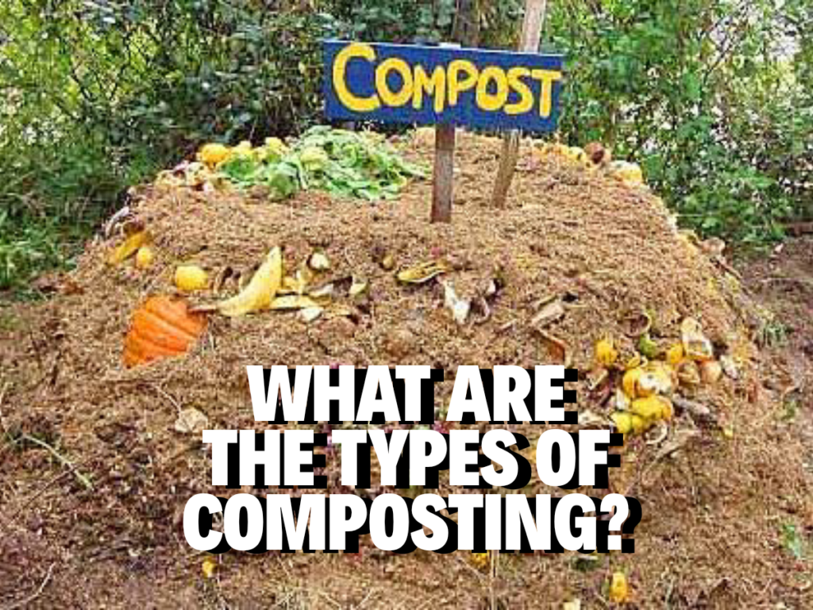

# 4 Different Types of Compost and Which One Should I Use?

Compost can be confusing because different types provide different benefits.  
Here are the different types of compost available on the market (or fermented by you， for example, 
organic compost generated using the GEME rapid composter) and on which greenery they work best.

## Four Primary Compost Types

There are four primary compost types: compost, farmyard manure, green manure, and vermicompost. Each type has its benefit
alongside mutual benefits. The point of compost is to nourish your soil to provide a healthy habitat in which your grass,
plants, and trees can thrive. Let’s break these four types down further.

## Compost
Composting is the result of microbial degradation of biological waste. Many people opt to make their posts using pet waste,
plant clippings, viable food scraps, and weeds. Compost is economical and environmentally friendly, although some people 
do not like the smell of the pile, which is why you can use GEME to achieve fast composting if you don’t feel like breaking
it down in your yard.  Thanks to adding up the all-natural complex microflora GEME Kobold, you get organic compost that 
is even more dynamic and nutritious than commercially available compost and garden compost.

## Farmyard Manure
You can guess what farmyard manure is: cow, horse, or other farmyard animal poop. This is good for just about any plant, 
but be careful, some farmyard manures are stronger than others and can kill plants if used too much. Manure is nutrient-rich 
and it lasts long in your garden’s soil, meaning you won’t have to use it as often. It doesn’t store well, however, 
and it needs to be fully fermented before it can be used.

## Green Manure
Green manure is a process that has been used for centuries by farmers to keep their crop soil healthy. Farmers grow crops
of green and leguminous plants and then break them down into the soil. As the plants decompose, they fertilize the earth. 
Green manure helps cotton, maize, rice, sugarcane, and wheat grow. If you have a vegetable garden, this manure can help 
with your corn. However, it contains limited protein content and takes longer to effectively boost soil nutrients.

## Vermicompost
Finally, vermicompost is made up of, well, vermin. Earthworms to be exact. These amazing creatures can turn your garden 
into a lush and flowering wonderland, provided the earthworms can thrive in the soil. Vermicompost is good for all plant 
life because earthworms encourage plant germination and improve the soil’s ability to retain water. 
