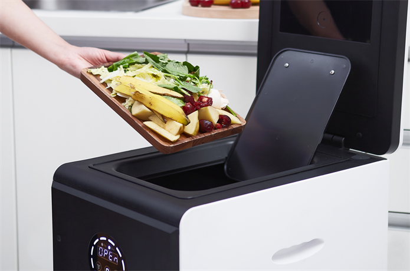

# Why do you need GEME?

## If you hate getting rid of the trash

The dripping sewage, the disgusting stench, the pouncing fruit flies, the wriggling maggots... If this is all you are experiencing.

You need GEME!

GEME will quickly reduce your garbage by 95%. The 5% left over is the best ready-to-use organic fertilizer. You may only need to remove the organic fertilizer once every six months, or even once a year.

Now, simply enjoy your life!

## If you're sick of cleaning up trash

Does it take even three times as long to clean up leftovers and food waste as it does to eat? Yes, that's the headache every household faces.

You need GEME!

The GEME allows you to add the trash anytime, you don't even have to push a button, wait for decomposition to finish, or clean the inner canister.

Now you have more time to talk with your family, play with your kids, or listen to music and read a book!

## If you think garbage is disgusting

If you can't leave your garbage outside because the critters that follow the smell will then turn your lawn into a landfill, you can't do anything about the old garbage that keeps rotting and stinking at room temperature in your kitchen garbage can.

You need GEME!

GEME breaks down this garbage quickly and quietly in 6-8 hours and eliminates all odors. Now, only good scents from food are left in your kitchen. Cheers!

Empty the trash bin with biotech magic, GEME only belongs to the better you!

