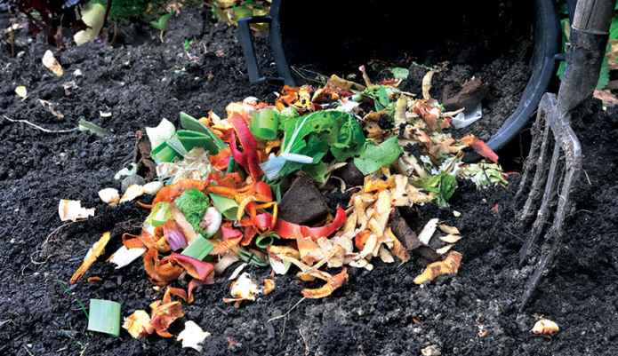
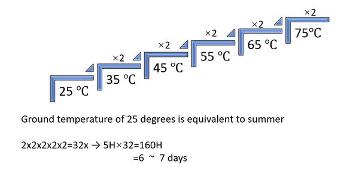
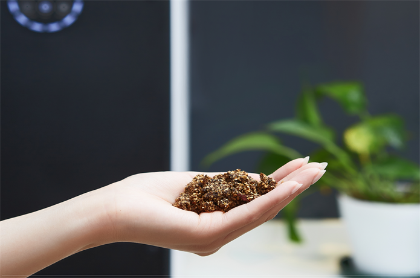

import ReactPlayer from 'react-player'

# Quick Compost in 6-8 hours?

It's not magic, it's science.

The essence of composting is a dynamic process achieved by the interaction of multiple microbial communities with very 
rapid community structure succession.

<!-- truncate -->

The initial heating and high-temperature stage can play a role in killing harmful substances such as pathogenic pathogens, 
insect eggs, weed seeds, etc., but the main role of microorganisms in this process also includes metabolism and reproduction, 
while producing a small number of metabolites, which are neither stable nor easy to be absorbed by plants; after the cooling 
and decomposition period in the late stage of composting, microorganisms will carry out the humification of organic matter,
and in this process produce a large number of metabolites that are beneficial to plant growth and absorption.
Therefore, traditional composting generally takes 4-6 months.

It is based on this that many people are full of doubts about short-term composting.

But do you know that shore-time compost is impossible?

Fermentation at a temperature of 75 to 80 ℃ for 5 hours increases microbial activity (decomposition power) by a factor of 
2 for every 10 ℃ rise in temperature.

The decomposition time of the microbiota in GEME for 5 hours is equivalent to 7 days in summer in nature.

Moreover, during the warming process, GEME provides an adequate air supply and agitation, equivalent to turning in a 
natural compost pile, again speeding up the decomposition rate.

Unlike previous facilities that call themselves fast composters, GEME replicates the entire process of natural composting,
accelerating the decomposition of bio-waste by providing a more suitable environment for the microbiota to multiply and decompose.

GEME-Kobold is the world's only proven high-temperature resistant microbial complex from nature, and it is this microbial 
complex that plays a key role in composting.

Therefore, GEME not only achieves short composting times, but because of GEME-Kobold, the compost has high activity and 
high nutritional value.

Witness the [miracle moments](https://youtu.be/asNRoqkC_BA) in these no editing one shot live videos.

:::info
6.5 hours with apple, bread, mango, and pizza.
:::

    <ReactPlayer 
        className="video__player" 
        controls height="100%" 
        url="https://youtu.be/PttMJEYb17A" width="100%" 
    />

---

:::info
1.5 hours outside view oneshot video record
:::

    <ReactPlayer 
        className="video__player" 
        controls height="100%" 
        url="https://youtu.be/L7fWDPDQwz4" width="100%" 
    />

---

:::info
1 and half hours inside view record
:::

    <ReactPlayer 
        className="video__player" 
        controls height="100%" 
        url="https://youtu.be/Vm7GOKaOg68" width="100%" 
    />

