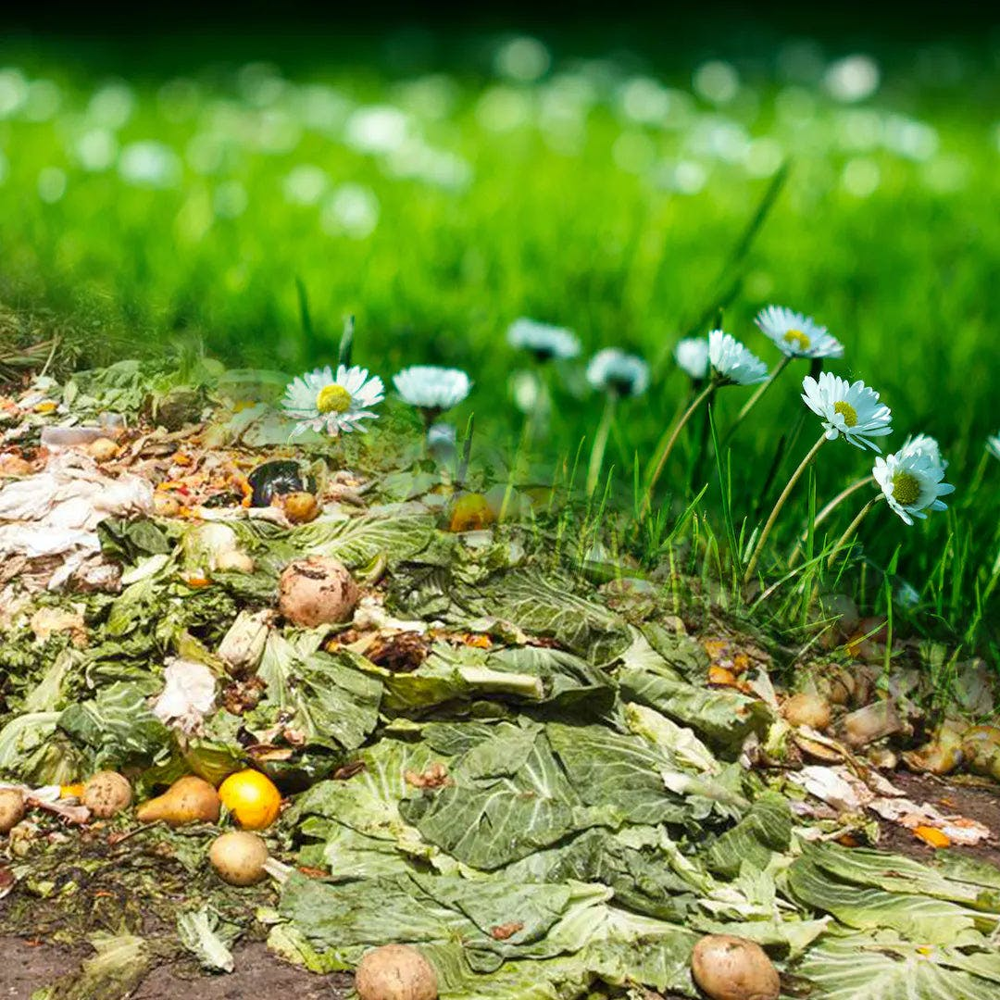
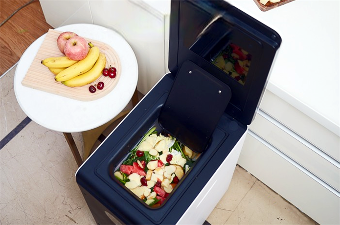
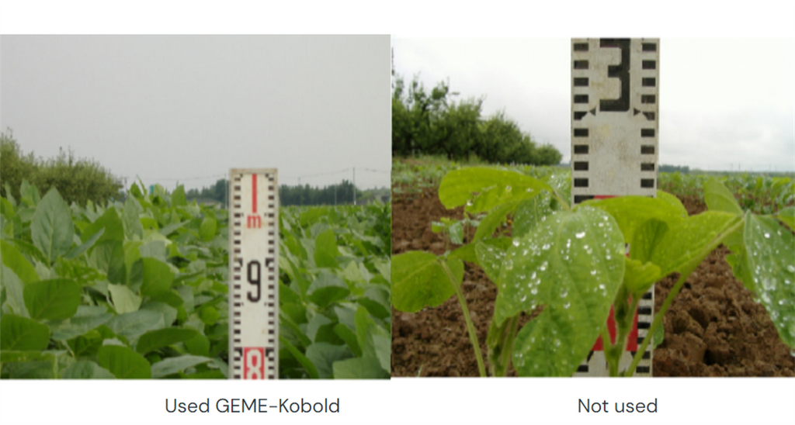
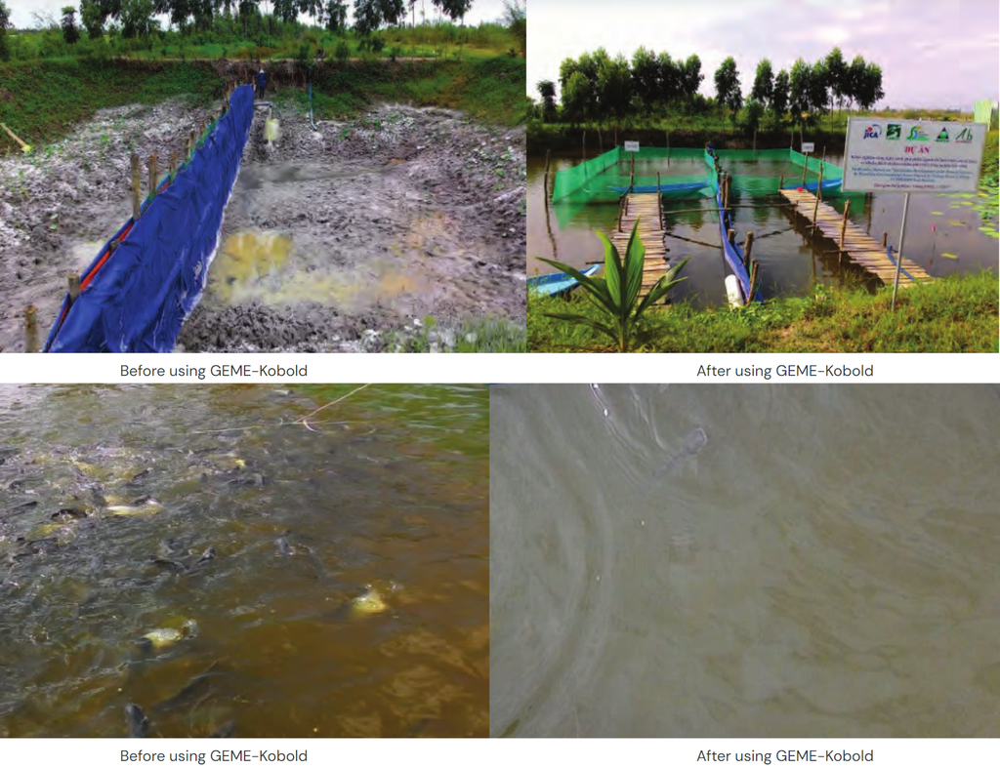

import ReactPlayer from 'react-player'

# Magic? No! It's science!

GEME and GEME-Kobold are a combination of AI devices and natural microflora, a combination of technology and nature.

There is no other home fast composting device on the market that is smarter than GEME.

Add garbage at any time;
Dispose of it at any time;
No waiting for the garbage to put stink and then dispose of it at once;
Convenient and easy to use, even without pressing a button, you have to do only one thing - throw in your garbage;
Intelligent thermal protection and open lid stop function allows children and the elderly to use it with confidence;
No need to clean after use, this is the essence of convenient life;
No need to replace the filter and automatic intelligent start-stop energy-saving settings, so you use it at a low cost...

If we talk about GEME-Kobold, it is the unique of the world - the only one in the world with a proven high-temperature-resistant 
complex of natural microflora.

GEME-Kobold has been discovered and validated so far, which is an ancient microbiota with a long history that has gradually
achieved success after decades of development. It is also not an artificial microbiota developed through biotechnology.

We use GEME to provide the best conditions for its reproduction and decomposition, allowing it to break down and reproduce 
faster than in its natural environment.

Biological waste, especially food waste, is rich in protein components, which is a good organic fertilizer raw materials. 
In the optimal humidity, temperature and aerobic environment provided by GEME, GEME-Kobold maximizes the fastest possible 
reproduction and decomposition of organic waste, turning them into 95% clean air and 5% organic compost. These by-products
can be used not only for soil improvement but also to purify water bodies.

We are not miracle workers, we are simply practitioners of the laws of nature.

Talk is cheap, let's check the evidence! This is a raw video completely record how it compost 5 pounds food waste, in just 7 hours. You can ignore the boring part of the middle, but don't miss the last 10 minutes at the end. You will be shocked.

    <ReactPlayer 
        className="video__player" 
        controls height="100%" 
        url="https://youtu.be/asNRoqkC_BA" width="100%" 
    />

