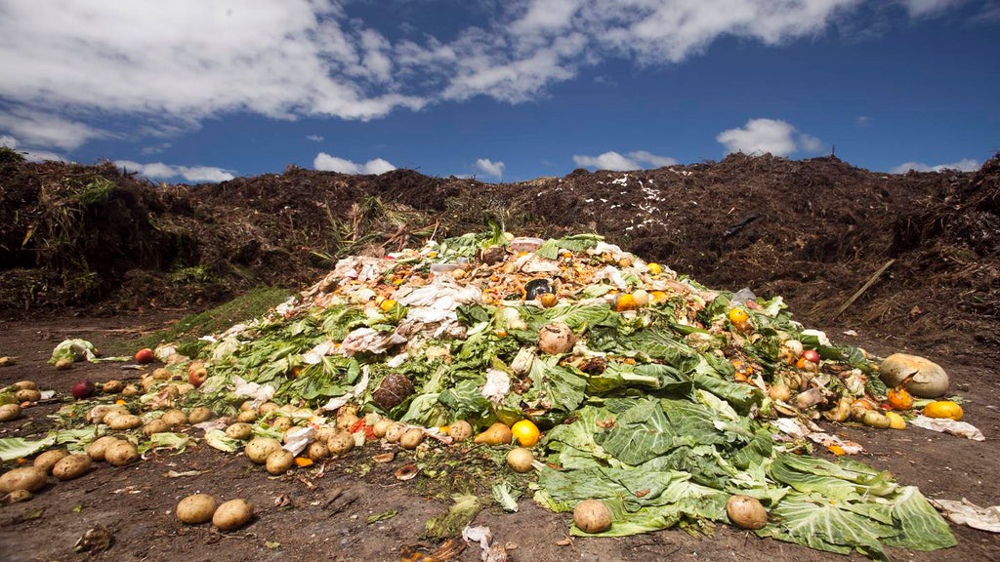

# GEME lets you say goodbye to sewage ridden wet waste

Biological waste, especially food waste, is rich in protein components, which is a good organic fertilizer raw materials, 
but they are also perishable, easy to produce, and mix a lot of pathogenic bacteria and insect eggs, weed seeds, 
and other harmful substances. This leads to the negative consequences that most of the biological waste you see will be 
foul smell and sewage flow.

<!-- truncate -->

GEME provides the right temperature, humidity, and plenty of air for the change, GEME-Kobold multiplies and decompose, 
eventually transforming bio-waste into 5% dry organic compost and 95% clean air.

Even if you put in too much waste or too much water, the GEME allows you to turn on the dehumidification function with 
the dehumidification button to ensure that your composting process is always at the right humidity level, resulting in
a dry, odorless, and tasteless organic compost with a 15% water content in a very short time.

You can use it to fertilize your plants; you can wash it away with running water and it will not pollute the water but 
also purify it; you can also treat it as normal garbage instead of wet garbage, because after the GEME treatment the 
bio-waste has become a hygienic and safe organic compost, no longer a dirty garbage where pathogens breed.

It's time to say goodbye to the old garbage cans with dripping sewage, disgusting stench, fluttering fruit flies, 
and wriggling maggots, GEME brings you a new and different life experience.

