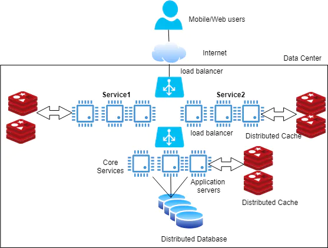
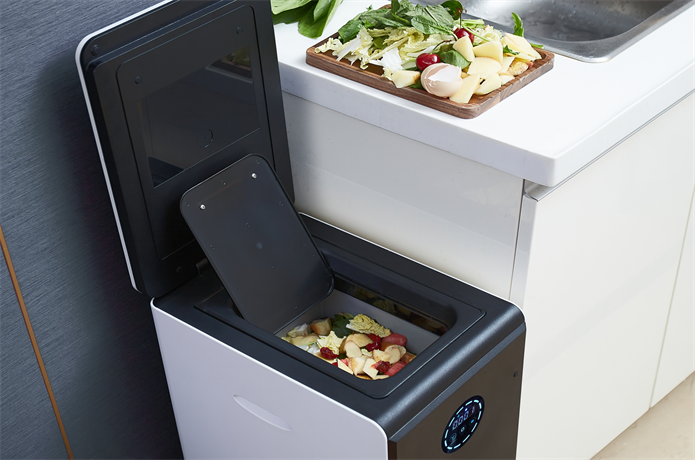
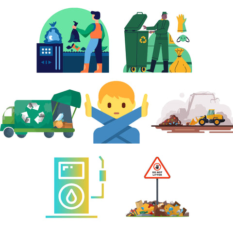
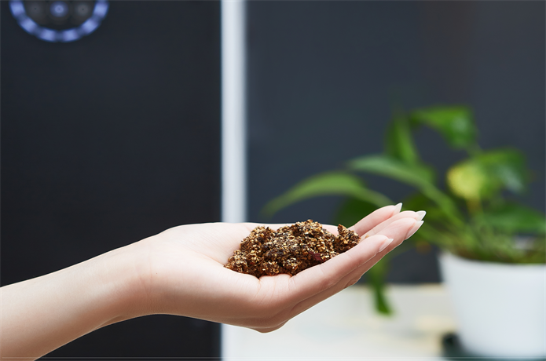
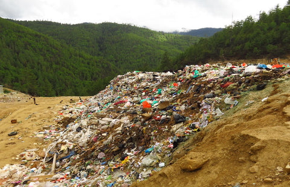
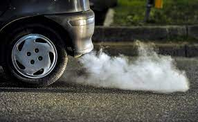
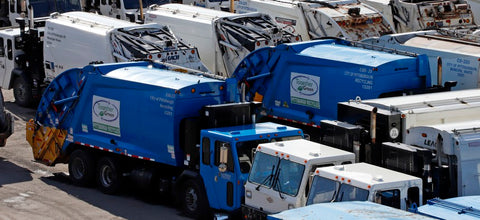

# Redefine garbage, we can do better

Food waste processing is a hard problem to solve. Many municipalities spent tons of effort to collect, dispatch, process 
and landfill them. Inspired by modern software architecture called distributed systems. How about solve the waste problem 
in the distributed system design thinking model? Eliminate them in place! When more and more people join the movement, 
it can significantly reduce the carbon footprint in the earth.

Recycle them in the place it is generated. One of the ways is composting! Some people practice this by composting in their yard. 
However, not everyone is a composting guru, not everyone gets patient to wait such a long time, 
not everyone bear the smelly from the composting pile.

Another option is using a magic trash bin(electric compost bin) to help you do the composting. Ordinary people like you 
and me can easily solve their daily food waste problems easily without changing any habits, while it helps to contribute 
to environmental protection.

GEME is a revolutionary device that is super efficient, odorless, and silent.

This means you can avoid waste by quickly converting your bio-wastes into organic compost.

It helps you keep bio-waste out of landfills and incinerators for a greener lifestyle.

Compared to sending food waste directly to a landfill, composting 1kg of food waste per day with GEME can prevent up to 
324kg of carbon emissions annually.

Assuming that GEME composts 356kg of food waste per year, this can reduce approximately 134% of carbon emissions that 
would be produced by the same food scraps in a landfill.

Up to 95% of food waste is broken down into clean air by GEME.

This means a direct reduction of 95% of the methane gas emitted by landfill food waste.

This also means a direct reduction of 95% of the fuel used to burn waste and toxic dioxin emissions.

This also means a direct reduction of 95% of the carbon emissions of removal vehicles and removal costs.

Stop hesitating on protecting our planet while making your life easier. 
[GEME](/) is the simplest solution to make this happen.
