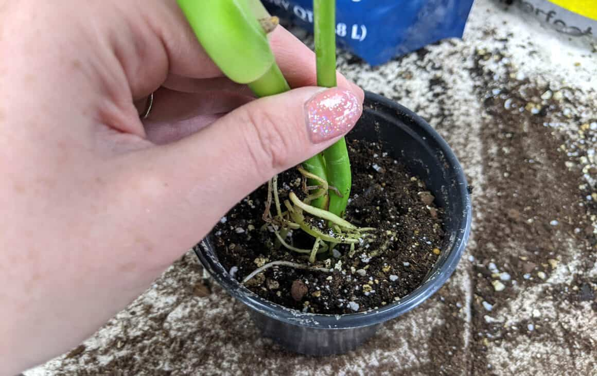
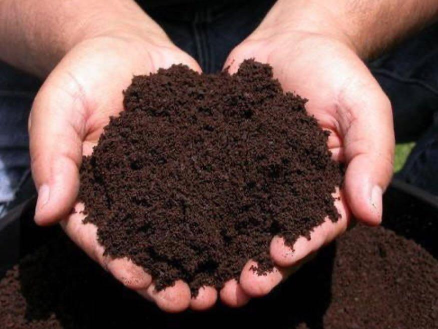
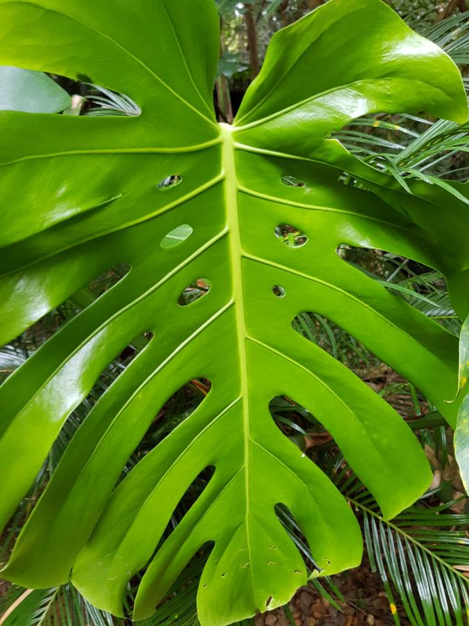

# 8 tricks to teach you to grow beautiful Monstera

Monstera is a beautiful plant which is very popular for indoor planting lovers. It's enjoyable to own a green monstera 
plant in your house. However, sometimes people might encounter some problems when the mostera is growing. Here are eight
tips to introduce how to take care of your mostera better. It is easy to pick up and practice.

<!-- truncate -->

## Prefer warmth, avoid severe cold

Monstera is native to the tropical rainforest of Mexico. It likes a warmenvironment and avoids freezing and cold weather. The temperature above 5 ℃ will not be damaged by freezing, and it will grow well above 12 ℃.

## Prefer shade and avoid strong light

Although Monstera is native to the tropics, it is sensitive to direct sunlight and drought. These conditions can cause dead leaves.

This plant grows well in semi-shade environments and has strong shade tolerance. It develops aerial roots and large, bright and dark green leaves when grown in these conditions.

To ensure optimal growth, Monstera should be placed indoors in a shaded area during summer months. Avoid exposing it to direct sunlight on balconies as this may cause death. During winter when temperatures drop, some sun exposure is acceptable but still avoid direct sunlight.

## Likes wet and avoids waterlogging

Monstera likes to grow in a humid ecological environment and needs sufficient water and certain air humidity during the growth period. Daily watering, can be done 1 time a day.

In summer mornings and evenings. When the weather is dry, it is necessary to sprinkle water on the leaves and the surrounding environment to ensure fresh and moist air and bright leaves;

In winter, water once every 3 to 4 days, and spray the foliage once every 7 to 10 days, mainly to clean the leaves, keep the plants evergreen and fresh, and improve the ornamental value.

During winter, water your plants every 3 to 4 days and spray the foliage once every 7 to 10 days. This will help keep the leaves clean, maintain their evergreen appearance, and enhance their ornamental value.

It is not advisable to water too much in the non-growing period to avoid waterlogged.

## Like fertile soil and avoiding lean soil

Monstera likes fertile soil, especially fertile sandy loam. Although it can grow on thin red-yellow soil,
the growth becomes weak, the tree shape is deformed, the leaves become smaller, and the leaf color becomes lighter,
which affects the viewing effect. During the growth period, thin cake fertilizer and water should be applied once every half month.
If there is enough fertilizer and water, Monstera will grow with pleasant leaves.

Daily fertilization can be flexibly applied according to the growth of Monstera, but avoid hypertrophy.

## Like organic avoid chemical fertilizers

Monstera should be regularly applied with organic fertilizers. You can turn your daily food waste through GEME into an 
all-natural, highly nutritious organic compost within 6-8 hours to fertilize your Monstera. It will activate the beneficial 
microorganisms in the soil, make your Monstera's tree vigorous and the leaves are as large as disks, the leaves are thick, 
and the leaves are dark green and glowing, especially the tortoiseshell pattern is clearer and distinct.

## Prune in time

The newly planted plants should be set up in time to grow according to the specified shape, and at the same time, 
they should be pruned in time to ensure the beauty of the plant shape.

## Pest control

It is necessary to closely monitor, actively prevent pests and diseases and eliminate them in time once they occur.
After you apply the natural organic compost made by GEME to your Monstera, the root system of the Monstera will be stronger, 
and the root system will discharge aromatic substances that keep pests away,making your Monstera healthier without the 
use of pesticides growing up.

## Change the basin in time

This is a problem that many flower lovers ignore, thinking that as long as the plant has sufficient water and fertilizer, 
everything is ok.

In fact, it is not. Monstera needs to be repotted once a year, which can be carried out between March and April.
When changing the pot,| remove a part of the old soil, replace it with new soil, cut off the deadroots, and then add 
decomposed organic fertilizer or phosphorus and potassium fertilizer as base fertilizer in the pot.

You can also replant your Monstera after mixing the organic compostgenerated by [GEME](https://www.geme.bio/product/geme) with the old soil in a ratio of 1:8,
which will not only provide sufficient nutrients for your Monstera but also prevent the occurrence of diseases, healthier growth.
After changing the pot,the Monstera will have a 1-2 week adaptationperiod, and then it willgrow vigorously.
