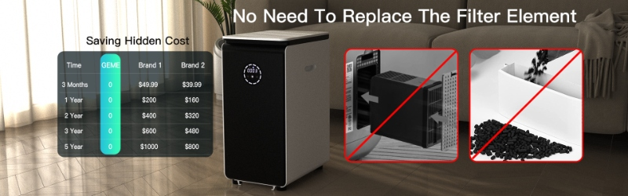

# Transforming Food Waste: 5 Reasons Why GEME Composter is Your Solution

Food waste is a global problem that demands our attention. Did you know that nearly one-third of all food produced for 
human consumption goes to waste? This staggering statistic highlights the urgency of finding sustainable solutions to 
combat this issue. In this article, we will explore the transformative power of the [GEME Composter](/product/geme) 
and why it is the ultimate solution for tackling food waste head-on.

## Environmental Impact

Food waste contributes significantly to greenhouse gas emissions and strains our planet's resources. With the GEME Composter,
you can make a positive environmental impact by diverting food waste from landfills. Through its innovative technology,
the composter accelerates the decomposition process, minimizing methane emissions and reducing your carbon footprint.

## Nutrient-Rich Compost

By composting your food waste with the GEME Composter, you can create nutrient-rich compost that enhances soil fertility.
The compost can be used in your garden, potted plants, or even donated to local community gardens.
This sustainable practice not only reduces waste but also promotes healthy plant growth and contributes to a circular economy.

## Convenience and Ease of Use

Unlike traditional composting methods, the GEME Composter offers a convenient and hassle-free experience.
With its automated process, you can effortlessly transform food waste into compost without the need for constant monitoring
or manual turning. The user-friendly interface and intuitive design make composting a seamless part of your daily routine.

## Space-Saving Design

Living in urban areas or limited spaces shouldn't deter you from composting. The GEME Composter features a compact and 
space-saving design, making it ideal for apartments, small gardens, or even kitchen countertops. Its sleek aesthetics 
and efficient utilization of space make it a perfect fit for any home or environment. It is not limited to kitchen countertops, 
you can also place it in the living room, garage, or even bedroom. Then it won't occupy your kitchen countertop.

## Cost Savings

Investing in a GEME Composter not only benefits the environment but also saves you money in the long run. By reducing 
the amount of waste you send to the landfill, you can lower your waste disposal costs. Additionally, the nutrient-rich 
compost produced by the composter eliminates the need for expensive fertilizers, further adding to your savings.

## Conclusion

Food waste is a critical issue that requires our attention and action. 
With the GEME Composter, you have the power to transform food waste into a valuable resource while making a positive 
impact on the environment. Embrace the solution that aligns with your commitment to sustainability and join the movement
towards a greener future.

