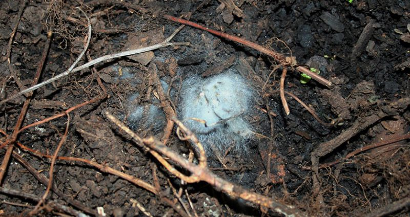
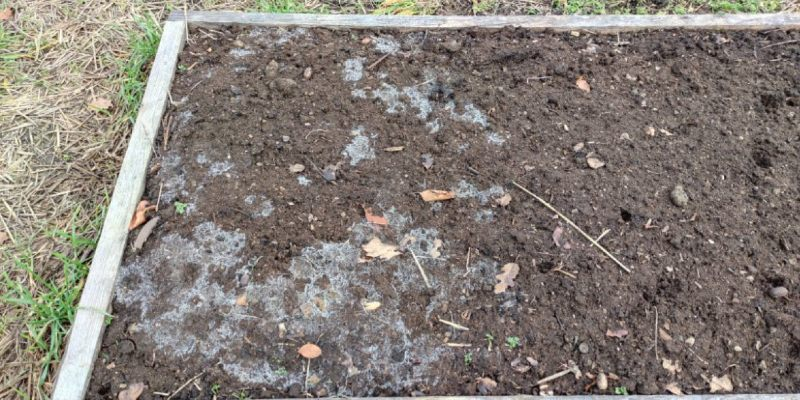

# Why my compost has white mold, should I worry it?

So, your plant paradise gets a dose of GEME magic, and voila – white mold makes an entrance! 
Is it the plant party we've all been waiting for, or should we sound the alarm? Let's dive into the mystery.

<!-- truncate -->

## 🌱 Detective Scene: The Moldy Pot Saga

Wondering why your soil's doing the moldy mambo after a compost boost? It's not a disco – it might be actual mold 
throwing a soiree. Blame it on those sneaky mold spores having a fiesta in your compost's damp retreat.

## 🔍 Possible Culprits: The White Mold Suspects

1. Actual Mold Mayhem: Maybe your compost stash had secret mold agents itching to grow in the soil. 
Store it dry next time – mold doesn't like a dry party!

2. Fungal Fandango: Compost is like a VIP lounge for fungi. Some fungi love to show off their white, web-like moves. 
Are they mold? Nah, just the cool fungi crew enjoying the spotlight.

3. Nutrient Nudging: Compost messes with soil nutrients and pH, giving fungi and microorganisms a playground. 
It's like a buffet for them, and the white mold might be their favorite dish.

4. Water Works Woes: Too much water? Mold and fungi love a good soggy dance floor. 
Check your watering – plants like a sprinkle, not a flood!

## 🎬 Conclusion: A Moldy Whodunit

Before you whip out the garden detective kit, remember:

If it's mold mayhem, scoop out the affected soil and give your plants a fresh start.
Fungal fiesta? Let them groove – they're the plant's backstage crew.
Nutrient or watering drama? Tweak the script – adjust soil and watering tricks for a happy encore.
It's a plant mystery, not a horror show! 🌿🕵️♀️✨"
