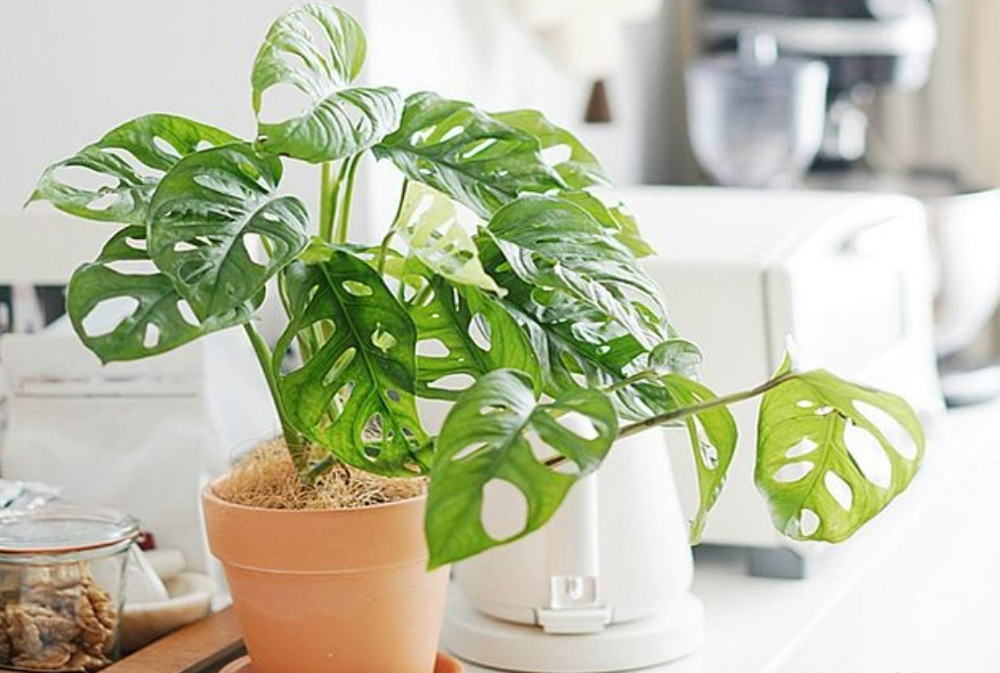
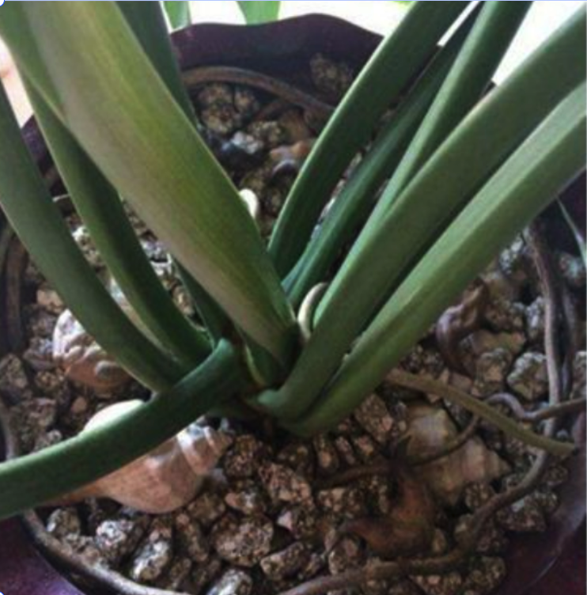
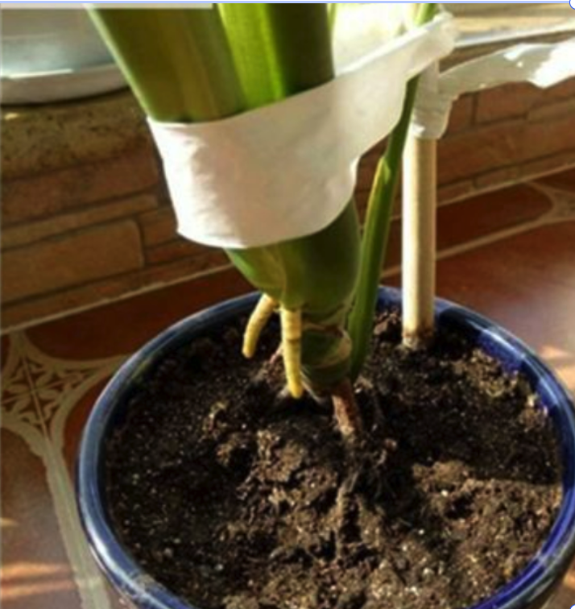
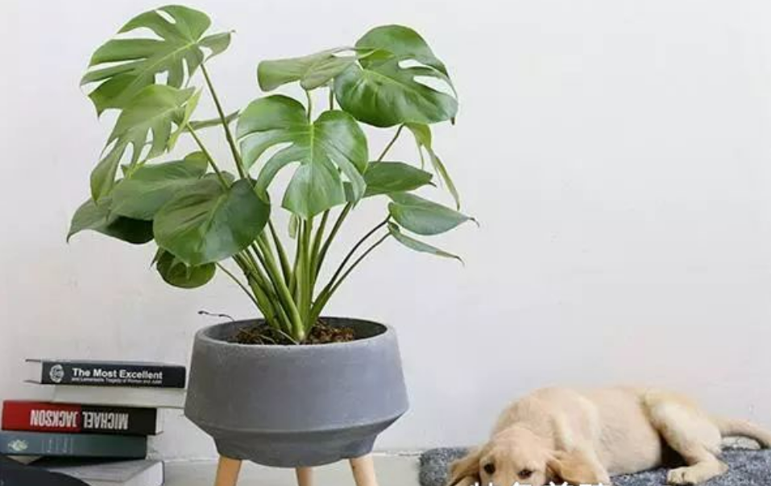

import Columns from '@site/src/components/Columns'
import Column from '@site/src/components/Column'

# How to Shape Monstera

When you see monstera in other people's photos, are you envious? Don't worry, you can also have a beautiful monstera 
and post it on your INS to get crowds and likes.

We all know that monstera has huge leaves, and if it is planted vigorously but lacks pruning, it will only get bigger and bigger.
This is not only a messy plant but also a lot of fertilizer.

So proper pruning for it is necessary.

Is your Monstera growing too lush, causing the branches, vines, stems and leaves to be too dense, dumping, crooked, etc.?

If so, you should slim down for it.

Let's take a sharp knife and trim off the excess side shoots and stems. In this way, nutrients will be concentrated on the remaining branches and leaves, these branches and vines will be more robust, and the plant sharp of monstera will be more beautiful.

After pruning, if necessary, you can also tie the main stem with cloth strips and support it with wooden sticks to help the crooked Monstera to restore its upright posture.

<Columns>
  <Column className='text--left'>
    
    **Before**
  </Column>

  <Column className='text--center text--left'>
    
    **After**
  </Column>
</Columns>

If you don't want the monstera to grow too tall, you can cut off the top half from the growth point at the top of the plant.
At the same time, you can also cut off some excess lateral shoots, some old leaves and dead leaves, so as not to rob nutrients.

After such pruning and shaping, the plant can avoid growing too high, and it will grow relatively short and strong, and it looks more beautiful.

