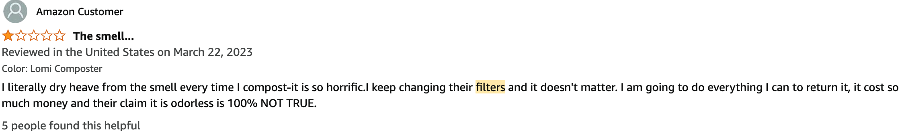

import Columns from '@site/src/components/Columns'
import Column from '@site/src/components/Column'
import ReactPlayer from 'react-player'

# What is the Difference Between GEME Composter and Other Electric Kitchen Composters?

Many people ask us this question many times. I think this question worth for a blog to explain it.

GEME Composter is the world's easiest way for home composting, it is challanging any other products so far by 2023. 
GEME is the world's only one product that use biotchenology method for real composting in Amazon online stores.

Although all of these similar products share the same mission: food waste recycling.

However, all others are dehydrating based composter, they are not really do composting.

<!-- truncate -->

Most of these units are more like bread makers, shred the food waste into pieces, cook at high temperatures, and eventually 
dehydrate the food waste and make them looks like compost or soil.

While GEME simulates the natural biological decompose process, by choosing the best micribes and providing the best environemnt.
Making the whole process quickly and comfortable indoor.

Let me breakdown the difference in several aspects.

## Technology

Among all other differences, this one is the most important one. GEME uses totally hardcore biotechnology that other 
products can not follow. You can simply copy the machine, but without the specified microbiota(GEME Kobold). 

The fancy machine is just a piece of junk. GEME's key competition is not the hardware, but the microrganism techonology.

### Comparison

GEME use biotechonology to breakdown the foodwaste, it's real composting method. It was similar to fermentation, 
but fermentation is anaerobic while composting is aerobic. 
Inside GEME there is an oxygen system that makes the aerobic process happen and provides the best environment.

While other products like Lomi, produce only cooked waste, they just looks like compost, but actually not.

Mr Robert Pavlis discussed this in this [great article](https://www.gardenmyths.com/lomi-electronic-composter/), 
very detailed. Note, the team seems aware of this and start calling their byproduct as pre-compost or lomi-compost, 
whatever created words that make it misleading.

More reviews for those machines use the same technology as a bread maker.

<Columns>
  <Column className='text--left'>
    

        <ReactPlayer 
            className="video__player" 
            controls height="100%" 
            url="https://youtu.be/bXZG-kzlhPY" width="100%" 
        />
    

  </Column>

   <Column className='text--left'>
     

        <ReactPlayer 
            className="video__player" 
            controls height="100%" 
            url="https://youtu.be/d8M9E_XC3So" width="100%" 
        />
    

  </Column>
</Columns>

|            | GEME                                                                                             | Lomi                            |
|:-----------|:-------------------------------------------------------------------------------------------------|---------------------------------|
| Technology | Composting                                                                                       | Dehydration                     |
| Byproduct  |                                                                  | 
| Reviews    |   [Amazon Review Link](https://www.amazon.com/dp/B0BR7XCFL2) |   [Amazon Review Link](https://www.amazon.com/product-reviews/B0B3FSQTRS)

### Conclusion

:::success
GEME composter does real composting. Lomi-like "composters" only dehydrate food waste.
:::

## Size

So far, GEME composter is the most large home composter among the marketing. With 19L volume and up to 2kg daily
processing capacity. You can handle your whole family's food waste without any problem. GEME also performs very well in 
classrooms in school.

### Comparison

Here is the detailed data.

<Columns>
  <Column className='text--left'>
    
    **GEME Composter**
  </Column>

   <Column className='text--left'>
    
    **Lomi Composter**
  </Column>

   <Column className='text--left'>
        
    **Vitamix Foodcycler**
  </Column>
</Columns>

### Conclusion

:::success
GEME wins the size, much much far away. Up to 6 to 7 times larger than other units.
You can keep adding your garbage for months without cleaning it.
:::

## Daily Using Method

GEME is designed to be easy to use. If you know how to use a trash can, you know how to use GEME.

### Comparison
<Columns>
  <Column className='text--left'>
    
    

        <ReactPlayer 
            className="video__player" 
            controls height="100%" 
            url="https://youtu.be/KE1kh_67Dmc" width="100%" 
        />
    

    **Add Food Scraps Anytime**
  </Column>

   <Column className='text--left'>
     

        <ReactPlayer 
            className="video__player" 
            controls height="100%" 
            url="https://youtu.be/_tt5gnNpVsw" width="100%" 
        />
    

    **Wait Until Cycle Ends**
  </Column>
</Columns>

<Columns>
  <Column className='text--left'>
    

        <ReactPlayer 
            className="video__player" 
            controls height="100%" 
            url="https://youtu.be/LZzssf_gebU" width="100%" 
        />
    

    **Open & Put, Like Trash Bin**
  </Column>

   <Column className='text--left'>
     

        <ReactPlayer 
            className="video__player" 
            controls height="100%" 
            url="https://youtu.be/_tt5gnNpVsw" width="100%" 
        />
    

    **Push Button to Start, Like Bread Maker**
  </Column>
</Columns>

<Columns>
  <Column className='text--left'>
    

        <ReactPlayer 
            className="video__player" 
            controls height="100%" 
            url="https://youtu.be/_tt5gnNpVsw" width="100%" 
        />
    

    **No Cleaning Required**
  </Column>

   <Column className='text--left'>
     

        <ReactPlayer 
            className="video__player" 
            controls height="100%" 
            url="https://youtu.be/X4KYdPAehfU" width="100%" 
        />
    

    **Hard to Clean Bucket**
  </Column>
</Columns>

### Conclusion

:::success
Obviously, GEME is easier to use.
:::

You can add waste at anytime, just open and put, the most amazing part is no cleaning is required, and it can even store 
your daily food waste up to 3 months.

## Filters
Composting is the processing of rotting, there are odor. How to deodorize the smell becomes a challenge for any machine 
trying to solve the home composting problem.

### Comparison

|                 | GEME                                                                 | Lomi                |
|:----------------|:---------------------------------------------------------------------|---------------------|
| **Technology**  | Industrial Filter()                                                  | Carbon Filter       |
| **Replace**     | No need to replace	                                                  | Need replace frequently |
| **Cost**        | $0                                                                   | $45 per pod/bag     |
| **Yearly Cost** | $0                                                                   | $180 to $540        |
| **Duration**    | permenant                                                            | 5 to 10 cycles, 1 to 3 months |
| **Reviews**    | No news is good news. You can not discuss something not be aware of. | |

### Conclusion

:::success
GEME's filter system is obviously much more advanced. Also 0 costs in the long run.
:::

## ByProducts

GEME Composter produce organic compost, while other dehydrating based composters produce cooked and shredded waste.

### Comparison

|                         | GEME                                                                                                                                                                                                                                                                                                                                                                                                                                                                                                                                                                                                                                                                                                                                                                                                                                                                                                                                            | Lomi                                                                                                                                                                                                                                                                                                                                                                                                                                                                                                                                                                                                                                                                                                                                                                                                                                                                                                                                                                                                                                                                                                                                                                                      |
|:------------------------|:------------------------------------------------------------------------------------------------------------------------------------------------------------------------------------------------------------------------------------------------------------------------------------------------------------------------------------------------------------------------------------------------------------------------------------------------------------------------------------------------------------------------------------------------------------------------------------------------------------------------------------------------------------------------------------------------------------------------------------------------------------------------------------------------------------------------------------------------------------------------------------------------------------------------------------------------|-------------------------------------------------------------------------------------------------------------------------------------------------------------------------------------------------------------------------------------------------------------------------------------------------------------------------------------------------------------------------------------------------------------------------------------------------------------------------------------------------------------------------------------------------------------------------------------------------------------------------------------------------------------------------------------------------------------------------------------------------------------------------------------------------------------------------------------------------------------------------------------------------------------------------------------------------------------------------------------------------------------------------------------------------------------------------------------------------------------------------------------------------------------------------------------------|
| **Out Come**            |                                                                                                                                                                                                                                                                                                                                                                                                                                                                                                                                                                                                                                                                                                                                                                                                                                                                                                                |                                                                                                                                                                                                                                                                                                                                                                                                                                                                                                                                                                                                                                                                                                                                                                                                                                                                                                                                                                                                                                                                                                                                                             |
| **What It Actually Be** | Organic Compost                                                                                                                                                                                                                                                                                                                                                                                                                                                                                                                                                                                                                                                                                                                                                                                                                                                                                                                                 | Dehydrated Garbage (Fake Compost)                                                                                                                                                                                                                                                                                                                                                                                                                                                                                                                                                                                                                                                                                                                                                                                                                                                                                                                                                                                                                                                                                                                                                         |
| **How It Work**         | 
<ReactPlayer className="video__player" controls height="100%" url="https://youtu.be/asNRoqkC_BA" width="100%"/>
                                                                                                                                                                                                                                                                                                                                                                                                                                                                                                                                                                                                                                                                                                                                                                                           | 
<ReactPlayer className="video__player" controls height="100%" url="https://youtu.be/bXZG-kzlhPY" width="100%"/>
                                                                                                                                                                                                                                                                                                                                                                                                                                                                                                                                                                                                                                                                                                                                                                                                                                                                                                                                                                                                                                     |
| **Plant Growth Review** | There was a company a few years ago who promised one of these but it never got off the ground (pun intended). I do a lot of gardening and use outdoor composting for old plants, dead and rotten veggies. I also do a lot of food processing, cooking and canning and end up with a lot of bits I oftento feed to my dogs (which I still do) but I still ended up putting a lot in the outdoor compost.I now used The Geme for inside scraps as it creates compost 100x faster that the outdoor composters. Outdoor composters usually take 3 to 4 seasons here in Northern New England as it's only warm about a quarter of the year. The GEME creates beautiful compost/soil in a few days.Fertilizer has got so crazy expensive in the last few years this will def same me money over the years! [Source Link](https://www.amazon.com/gp/customer-reviews/RADT35V04AT71/ref=cm_cr_dp_d_rvw_ttl?ie=UTF8&ASIN=B0BR7XCFL2)                     | Lomi’s soil killed two of my plants. It grew mold([Source Link](https://www.amazon.com/gp/customer-reviews/RT4A5SA39WQNQ/ref=cm_cr_getr_d_rvw_ttl?ie=UTF8&ASIN=B0B3FSQTRS)). Lomi does not work!! it's a glorified food processor that takes forever to process the compost and smells HORRIBLE while running. The "dirt" it produces IS NOT DIRT. You have to mix it 10:1 with actual dirt to use it on plants - which isn't widely publicized. I mixed in the Lomi dirt with my plant's dirt and it killed several plants!! Please spare yourself and don't buy this - huge waste of money([Source Llink](https://www.amazon.com/gp/customer-reviews/R1WTJZIQ4YVM6Z/ref=cm_cr_getr_d_rvw_ttl?ie=UTF8&ASIN=B0B3FSQTRS)). This killed two of my plants. Customer service is a joke . All form letter crap! Tons on influencers on the pay role! Have to run 3-4 cycles to get soil dry. When asked for help they told me I needed to put better garbage in the lomi ! WTH!!! I eat a ton of organic vegetables from my garden but Nnnoooooooo! I need to put better garbage in the lomi. What ! I will just pick the food and put it straight in the lomi! Skip the hype!([Source Link](https://www.amazon.com/gp/customer-reviews/R3B6CG69LJE3PE/ref=cm_cr_getr_d_rvw_ttl?ie=UTF8&ASIN=B0B3FSQTRS))|
| **Why**                 | With Microbe Activity Process                                                                                                                                                                                                                                                                                                                                                                                                                                                                                                                                                                                                                                                                                                                                                                                                                                                                                                                   | Without Microbe Activity Process|

### Conclusion

:::success
GEME's ByProduct is the organic compost, not cooked waste.
:::

## Noise 

Both GEME Composter and other Lomi-like dehydrators use electricity to power up the machine.

However, GEME's electric energy only provides the best environment for microbes to work. Hence it is silent when running.

While other units need electricity power to drive the shreder and high temperature to cut food waste into pieces and cook 
them soft and then shredden to powder shape, making them looks like soil. You will hear noises like dish washers or a 
gridder when they start to work.

### Comparison

|                               | GEME                                                                                                                                                                     | Lomi                                                                                                                                                  |
|:------------------------------|:-------------------------------------------------------------------------------------------------------------------------------------------------------------------------|-------------------------------------------------------------------------------------------------------------------------------------------------------|
| **Sound Level**               | 35 dB to 50 dB                                                                                                                                                           | 70 dB+                                                                                                                                                |
| **Sounds Like**               | Fridge, Air Purifier	                                                                                                                                                    | Dish Washer, Bread Maker, Cooker                                                                                                                      |
| **How it Sounds**             | 
<ReactPlayer className="video__player" controls height="100%" url="https://youtu.be/CXszSZSsw4Q" width="100%"/>
                    | 
<ReactPlayer className="video__player" controls height="100%" url="https://youtu.be/k-3BIL6QLp8" width="100%"/>
 |
| **Reviews**                   | I love that I don't have to go out to my compost bin outside. My food scraps are turned into wonderful organic compost. No smell, works fast. [Amazon Customer Review](https://www.amazon.com/gp/customer-reviews/R3D2E0IDT42MF3/ref=cm_cr_getr_d_rvw_ttl?ie=UTF8&ASIN=B0BR7XCFL2) | After replacing that, no change. You cannot even be in the same room as the thing without earplugs. Seriously, it sounds like an airplane engine! [Amazon Customer Review](https://www.amazon.com/gp/customer-reviews/R31TTV8AACM6YO/ref=cm_cr_othr_d_rvw_ttl?ie=UTF8&ASIN=B0B3FSQTRS)    |

### Conclusion

:::success
GEME's much more silent when working mode. You can even put it in the living room.

:::

## Cleaning

GEME Composter requries no cleaning work at all, it is continues feeding design. That means you can keep adding it 
multiple times, since the waste will be reduced to 5% and a very small size is left. It will be quite long time to wait 
until the bin is full. Other dehydrators are cycle based design. Every time you use it, you need to take it out, wash it, 
and clean up, just like dish washing process and more troublesome!

### Comparison

|                    | GEME        | Other Dehydrator Products        |
|:-------------------|:------------|:---------------------------------|
| **Cleaning**       | No Need     | Clean After Every Time Use       |
| **Bucket Clogged** | Never       | Often                            |
| **Wash**           | No Need     | Dish Washer, Bread Maker, Cooker |

### Conclusion

:::success
GEME Composter wins obviously, who like clean up job in your daily life?
:::
