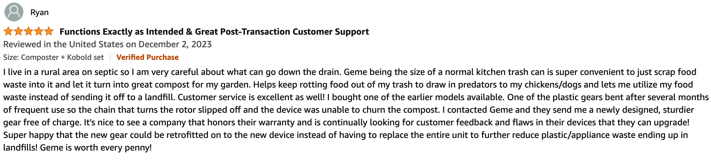

import Columns from '@site/src/components/Columns'
import Column from '@site/src/components/Column'
import ReactPlayer from 'react-player'

# GEME 2023 Summary and Early Meet GEME II

## Previously On GEME

In July 2022, We launched the first generation of GEME on kickstarter. It is the first time we did the kickstarter project.
We funded €30k+ in the 28 days, from 80+ backers' kindly support all over the world.

It's much lower than we expect, because the concept of turn food waste into compost, is not really new at that time.
There are some other brands that already use it, but bring products that not really did the job well.

Even though we are the first one really did it. There are several teams making dehydrate based "composter" and launched
multiple times on kickstarter and indiegogo, making people feeling tire of the concept. When we launch on it,
some of the comments labeled us as scam. It's so sad.

However, we overcame the challenges, and fulfilled most of the backer's perks. At the same time, we launch in the
United States and Europe Marketing. Several official sites have been setup and operating well since that time.

| **Source Name**              | **Store Links**                       | **Launch Time**                 |
|:-----------------------------|:--------------------------------------|:--------------------------------|
| **Official Website**         | [www.geme.bio](https://www.geme.bio)  | 2022-11-11                      |
| **Amazon**                   | https://www.amazon.com/dp/B0BV31KTCN  | 2023-02-04                      |
| **eBay**                     | https://www.ebay.com/usr/gemeofficial | 2023-09-05                      |
| **Walmart**                  | [Link](https://www.walmart.com/ip/GEME-19L-Electric-Composter-World-s-First-Bio-Compost-Machine-Composter-indoor-Electric-Food-Cycler-Turn-Waste-Organic-Compost-Kitchen-Kitchen-compos/1670817413)                              | 2023-10-23|

## Review

### GEME's green footprints all over the world.

After more than 1 year's operation. We have reached 20+ countries. 
Up to 1000+ families and agencies are using GEME to solve their daily food waste problem.

### Overview Rating

What did people say about GEME?

Let's see the overview rating from Amazon.

Overall they thought GEME worth the money even we are twice or even trible expensive than other competitors, 
which selling at the $299, but actually are dehydrators, not the same level.

The AI summary for all customers leaving reviews.

### What did people say?

#### Jordan, very early customer

[Amazon review source link](https://www.amazon.com/gp/customer-reviews/R3UJABQ4WQEDB6/ref=cm_cr_dp_d_rvw_ttl?ie=UTF8&ASIN=B0BR7XCFL2)
 

#### Noel, another early customer

[Amazon review source link](https://www.amazon.com/gp/customer-reviews/RPJWAZ645EP12/ref=cm_cr_dp_d_rvw_ttl?ie=UTF8&ASIN=B0BR7XCFL2)

#### Rayn, Alaska supporter paid extra shipping

[Amazon review source link](https://www.amazon.com/gp/customer-reviews/R2MCFRFEOBE7UU/ref=cm_cr_dp_d_rvw_ttl?ie=UTF8&ASIN=B0BR7XCFL2)

#### Michale, the Environmentalist

[Amazon review source link](https://www.amazon.com/gp/customer-reviews/RYIOPUAVV3AK3/ref=cm_cr_dp_d_rvw_ttl?ie=UTF8&ASIN=B0BR7XCFL2)

#### Keven, poor man got the wrong model

## Known Issues & Iteration

After 1 year operation, we do have some after-sale cases and customer feedback. Like software often get bugs. 
It's common that hardware will get some defeat. The key is iteration. We have 3 batch products shipped to the US. 
Each batch will improve some known issue at a super quick speed. Thanks for the great customer feedback, and our hardworking
engineering team.

### Paddle stop turning

This is the most often problem we have been discovered. It's indeed a common issue for the early batch product. 
Up to 20+% possibility. However, our team act quickly and solve the problem completley by redesign a new gear that compatible
to the old design, but works much better than the old one.

<Columns>
  <Column className='text--left'>
    
    **Before**
  </Column>

   <Column className='text--left'>
    
    **After**
  </Column>
</Columns>

### Black marks

Unlike other electric composters in the marketing that use carbon filter. 
GEME composter use **metal ion catalytic oxidation purification** technology. 
Which allows no need to replace the filter regularly. 
It is a permanent filter. However, some catalytic material goes out during shipping. 
This is the first time we have done international business. We are shocked that the last mile shipping in the US is so violent.
Hence, we add some protection to avoid the issue.

<Columns>
  <Column className='text--left'>
    
    **Before**
  </Column>

   <Column className='text--left'>
    
    **After**
  </Column>
</Columns>

### Too Big

Some customers bought and return, simply because our unit is too big, not fit for their home and kitchen. 
It's such a pity. We thought the big size could reduce more waste, but it turns out that some people living in apartments
keen to like a compact design and did not producte a lot fo waste in daily life.

### Price

So far the current model is big, and quality design, makes the price can't be low enough. It will be less affordable than 
other similar products that only dehydrate food waste.

## Next Generation Preview, Call for voting

Although we are working hard for the iteration to improve the current unit, we want to share a preview for the work we 
have been doing about the next generation model. All known issues will be completely resolved in the next genration modal. 
Price will drop, and the next version of kobold will be improved as well.

Please vote for your favorite appearance.

<Columns>
  <Column className='text--left'>
    **Model A**
    
  </Column>

   <Column className='text--left'>
    **Model B**
    
  </Column>

   <Column className='text--left'>
    **Model C**
    
  </Column>
</Columns>
