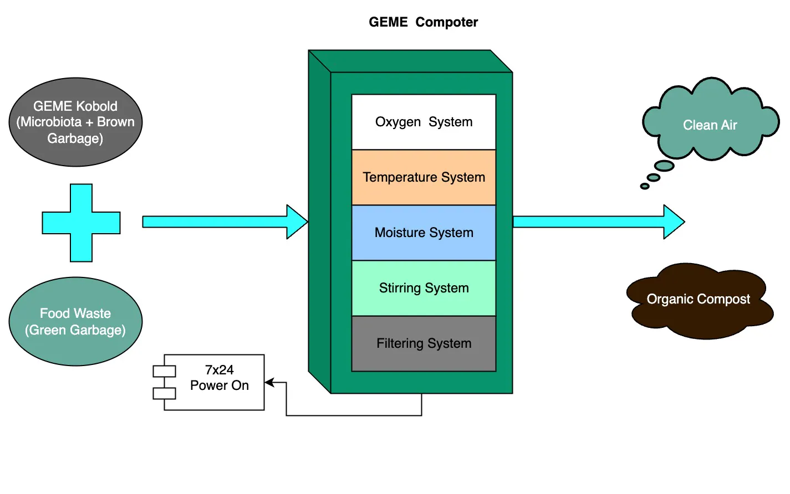
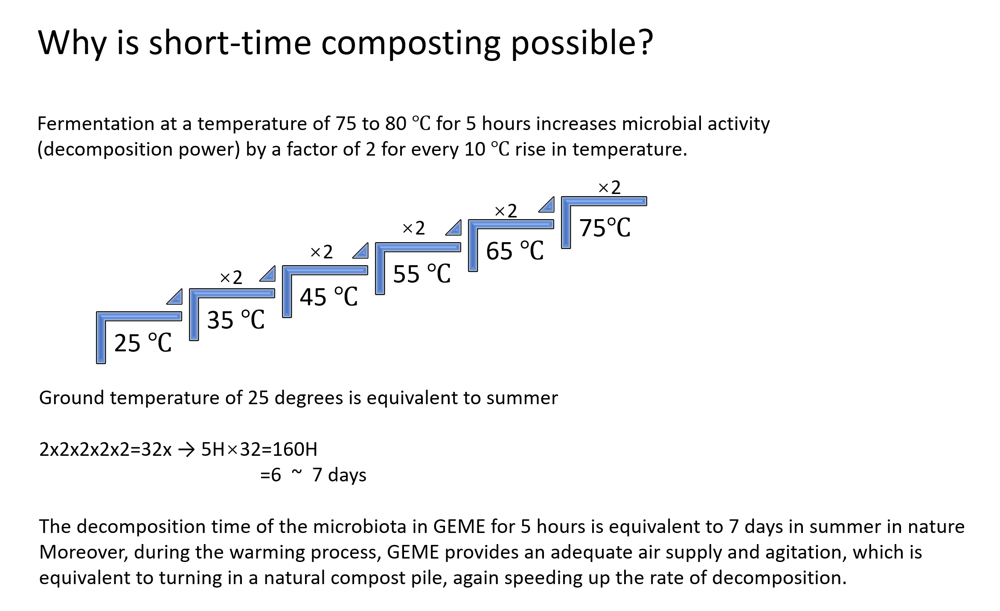
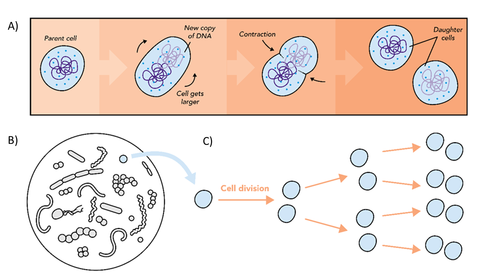
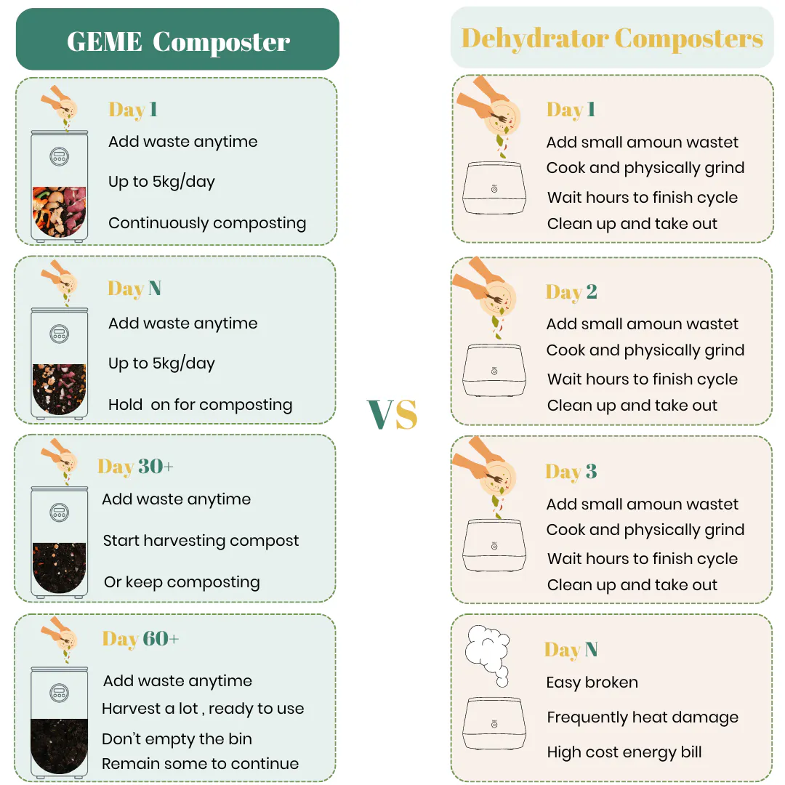

import Columns from '@site/src/components/Columns'
import Column from '@site/src/components/Column'
import ReactPlayer from 'react-player'

# How Does a Real Electric Composter Work?

If you search `How does an electric composter work` on Google, you will see Mr [Chris Deziel
](https://www.familyhandyman.com/author/chris-deziel/)'s [article](https://www.familyhandyman.com/article/what-is-an-electric-composter-and-how-does-it-work)
on the first result.

It says
> First, the device heats the scraps to a temperature of about 160 degrees, which kills pathogens and weed seeds. 
> Heating continues until the food is completely desiccated, Then it's ground up into granules. 
> Finally, the compost cools before you remove it from the appliance.

Very clear, concise and precise! 
Unfortunately, this is not for a real composter, but for dehydrator devices. For the difference between a real composter
and a dehydrator, check this [article](/blog/what-is-the-difference-between-geme-composter-and-other-electric-kitchen-composters) for detail.

<!-- truncate -->

## What is a real electric composter?

Before we talk about electric composter, we need to define the composter.
Composter is a device that can turn something into [compost](https://en.wikipedia.org/wiki/Compost). 
This process is also called "composting". And people use composter, usually happen for home composting.

> Composting is the biological decomposition of organic waste by recycling food and other organic materials into compost.[[1]](https://www.sciencedirect.com/science/article/abs/pii/B9780080885049003895)

Hence, the key for composting is the biological decomposition process. 
Heating and griding is a physical process, not a biological process. Therefore, those dehydrating devices are all fake 
composters. 

The real composter will keep the biological decomposition process alive.
Such as worm bins can also consider real composter, but that one is not electrical. 

For real electric composter, it uses electricity only to provide a best environment for the microbes to work better.
Accelerate the composting process.

## How many brands of real composters on the marketing?

Actually there are quite a number of brands of food waste composters available. Most of them are big and commercial use.

     

        <ReactPlayer 
            className="video__player" 
            controls height="100%" 
            url="https://youtu.be/epPl7dwqUWc" width="100%" 
        />
    

Those big guys works well for municipal scenario, but not for home. For one of the critical problem need to be carefully
solve before you want to put it in your home. That is the odor.

For real home composters, very little on the world. Only 2 brands. Reencle and [GEME](/).
While Reencle's microbe are far less efficiency than [GEME Kobold](/geme-kobold), but the working principle are very similar.

## How home composter works?
Take GEME for example. A real home electric composter works like a composting pile.

:::info
Simulate compost pile in a box 
:::

GEME composting solution offer 2 major parts: 
- The machine: [GEME Composter](/product/geme) 
- The microbes: [GEME Kobold](/geme-kobold)

### The machine
The machine is providing the best environment to let the microbes regenerate in an amazing speed. Then they eats food waste
and break the bio waste down.

There are some critical subsystems. 
- Aerobic exchange system
- Temperature control system
- Moisture control system
- Stirring system
- Filter system

The filter system is important for home composter, for it take care of the odor and make sure your house won't get smell.
The other parts of the system is typically simulate and aid the microbes to work better.

The stirring system will increase the surface of the food waste, hence more microbes can attach inside the waste.
The temperature and moisture system will adjust the best condition to control the microbe's regenerate curve.
The Aerobic exchange will offer enough oxygen, it can also help to reduce the smell too. Aerobic fermentation is not like
anaerobic fermentation, which usually create very bad smell. 
Aerobic composting create smell like dirt and soil, it is not stinky at all, also help for odor controlling. 

### The microbes

The microbes are the major workloads happen. They reproduce quickly and absorb energy from the food waste. 
Just like worms eat food, microbes also eats their food, our food waste. And both of them deliver compost.

Inside the GEME Kobold, most of them are bacteria. Bacteria reproduce primarily by binary fission, just like every single
cells creature does. 1 to 2, 2 to 4, 4 to 8.

> Under ideal conditions, some bacterial species may divide every 10–15 minutes—a doubling of the population at these time intervals.[[2]](https://www.britannica.com/science/microbiology/Reproduction-and-growth)

For more detail about how microbes works? We can have one more dedicate blog to explain better.

## Why get real kitchen composter?

For in the marketing. Many advertise composters are almost dehydrators, including Lomi and Mill.
Those dehydrator device help to reduce landfill, it's still good. But misleading people to take that as composting is 
not a good behavior. 

For real electric composter, the electric energy consumption is actually much lower than those dehydrators. 
And not mention how easy to use it, just like a trash can, not a bread maker to cook the waste again and wait for completed.

 
