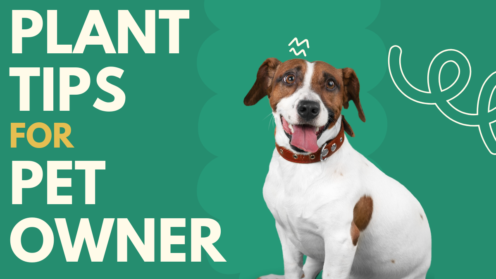

import Columns from '@site/src/components/Columns'
import Column from '@site/src/components/Column'
import ReactPlayer from 'react-player'

# Plant Tips for Pet Owners

If you’re a pet owner with a green thumb, it’s essential to know which plants are safe for your furry friends and which 
ones could pose a risk. Here’s a helpful guide to make sure your home and garden are both pet-friendly and beautiful.

<!-- truncate -->

## Pet-Friendly Plants 🌱

These plants are safe for your pets, making them perfect for your home or garden:

	- Alyssum
	- Blue Daisy
	- Boston Fern
	- Bottlebrush Tree
	- Camelia
	- Canna
	- Celosia Plumosa
	- Christmas Cactus
	- Coreopsis
	- Echeveria Succulents
	- Gerber Daisy
	- Gloxinia
	- Impatiens
	- Marigold
	- Nasturtium
	- Pampas Grass
	- Persian Violet
	- Petunia
	- Polkadot Plant
	- Rose
	- Snap Dragons
	- Spider Plant
	- Start Jasmine
	- Sunflower
	- Sword Fern
	- Viola
	- Zinnia

## Toxic Plants ⚠️

These plants are beautiful but can be harmful to your pets if ingested. Exercise caution when planting these or keep them out of reach:

	- Aloe
	- Begonia
	- Bird of Paradise
	- Bougainvillea
	- Calla Lily
	- Carnation
	- Chrysanthemum
	- Coleus
	- Cosmos
	- Dumb Cane
	- Elephant Ear
	- Fleabane
	- Gardenia
	- Geranium
	- Hibiscus
	- Hydrangea
	- Iris
	- Mother-In-Law Tongue
	- Pansy
	- Peace Lily
	- Pink Dianthus
	- Plumbago
	- Poinsettia
	- Primrose

## Poisonous Plants ☠️

These plants should be avoided if you have pets, as they are highly toxic:

	- Azalea
	- Castor Bean
	- Cyclamen
	- Daffodil
	- Easter Lily
	- Star Gazer Lily
	- Sago Palm
	- Tiger Lily

## Conclusion

While plants can add life and beauty to your home, it’s crucial to choose the right ones if you have pets. 
By selecting pet-friendly plants, you can ensure that your pets stay safe and your garden remains a peaceful retreat 
for everyone in your household.

Join the Home Depot Garden Club
Sign up and enjoy $5 off your next $50 in-store purchase. Sign Up Today

Remember to always do your research before introducing new plants into your home. Happy gardening! 🌿

This blog post was inspired by a plant guide seen at a Home Depot store, highlighting the importance of plant safety for 
pet owners.
