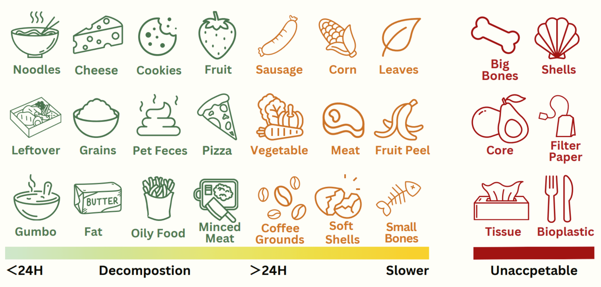

import Columns from '@site/src/components/Columns'
import Column from '@site/src/components/Column'
import ReactPlayer from 'react-player'

## How Long Does A Real Composter Take to Turn Food Waste Into Compost?

For most of the daily left over, it takes around 6 to 8 hours to breakdown the waste.
Check this uncut 7 hours video.(BTW, none of our competitors dare share such live video to public)

    

        <ReactPlayer
            className="video__player"
            controls height="100%"
            url="https://youtu.be/asNRoqkC_BA" width="100%"
        />
    

<!-- truncate -->

However, for some food waste like orange peels, it will take slightly longer. Because the fibers are hard to breakdown. 
Small bones take even longer.

**Note**, it takes few hours or days to breakdown, it is turning into the state of compost.
However, it still need more time to become finished compost. We recommend wait more than 45 days to take them our to use.
Or you can mix the unfinished compost with soil in 1:8 to grow your plant.

